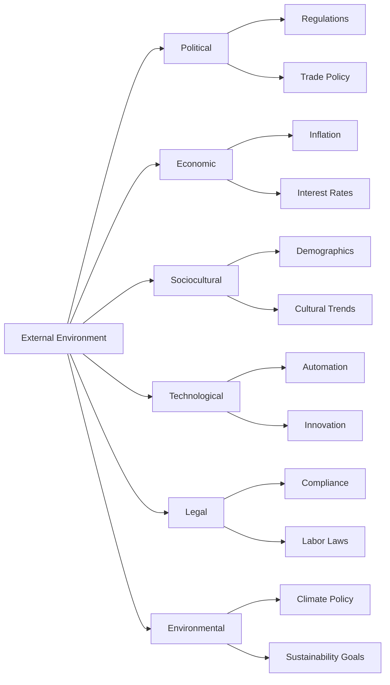

# PESTLE Analysis

**PESTLE Analysis** is a **strategic planning tool** used to systematically evaluate the external environment through six key lenses: **Political, Economic, Sociocultural, Technological, Legal, and Environmental**. It helps project teams understand the macro-environmental factors that can influence success, revealing both **opportunities and threats** beyond the organization’s control.

This tool is especially useful during **initiation and planning phases** to assess risk exposure and alignment with strategic context.

## Key Factors in PESTLE

- **Political** – Government stability, policy changes, regulations, tax policies  
- **Economic** – Inflation, exchange rates, interest rates, economic growth  
- **Sociocultural** – Demographics, cultural norms, education levels, consumer attitudes  
- **Technological** – Innovation, automation, R&D trends, digital infrastructure  
- **Legal** – Employment laws, safety standards, intellectual property, compliance  
- **Environmental** – Climate change, sustainability, ecological regulations

## Example Scenarios

- A global construction project is impacted by changing import tariffs (Political)  
- A mobile app is redesigned to meet new accessibility regulations (Legal)  
- A sustainability initiative gains traction due to rising environmental awareness (Environmental)

## Mermaid Diagram: PESTLE Environmental Breakdown

## Why PESTLE Analysis Matters

- Reveals External Forces – Identifies macro-level risks and enablers
- Supports Risk Management – Informs opportunity and threat planning
- Aligns with Strategy – Helps shape initiatives in harmony with external realities
- Improves Forecasting – Enhances situational awareness for long-term success

See also: [[SWOT Analysis]], [[Risk Management]], [[Environmental Factors]], [[Strategic Alignment]], [[Opportunity]].