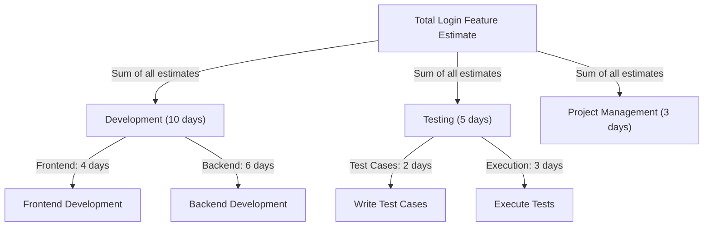

**Bottom-Up Estimating** is a method of estimating the **duration, cost, or required resources** for a project by aggregating estimates from the **lower-level components** of the Work Breakdown Structure (WBS). This approach provides high accuracy by analyzing each task individually and rolling up the estimates to determine overall project requirements.

## Key Aspects of Bottom-Up Estimating
- **Detailed & Accurate** – Estimates are based on individual work components.
- **Builds from the WBS** – Starts with the smallest tasks and aggregates upwards.
- **Time-Consuming but Precise** – Requires thorough task analysis but produces reliable estimates.
- **Supports Resource Planning** – Helps allocate time, cost, and materials accurately.

## Steps in Bottom-Up Estimating
1. **Break Down the Work** – Identify all tasks and subtasks in the WBS.
2. **Estimate Each Component** – Determine time, cost, and resources required for each task.
3. **Aggregate Estimates** – Roll up individual estimates to higher-level components.
4. **Validate & Adjust** – Review total estimates for feasibility and accuracy.

## Example Scenario

A software development project requires estimating the effort to complete a **Login Feature**. The estimation follows a **bottom-up** approach by breaking the feature into smaller components.

### **Mermaid Diagram: Bottom-Up Estimating Example**

## Calculated Estimate

| Task                          | Duration  |
|--------------------------------|----------|
| Frontend Development          | 4 days   |
| Backend Development           | 6 days   |
| Writing Test Cases            | 2 days   |
| Executing Tests               | 3 days   |
| Project Management Oversight  | 3 days   |
| **Total Estimated Duration**  | **18 days** |

## Why Bottom-Up Estimating Matters

- Improves Estimate Accuracy – Reduces risk by considering all work components.
- Enhances Resource Planning – Ensures proper allocation of labor, materials, and costs.
- Supports Risk Management – Identifies task-level risks before rolling up estimates.
- Increases Stakeholder Confidence – Provides detailed estimates backed by task-level analysis.

See also: [[Analogous Estimating]], [[Parametric Estimating]], [[Program Evaluation and Review Technique (PERT)]], [[Multipoint Estimating]].