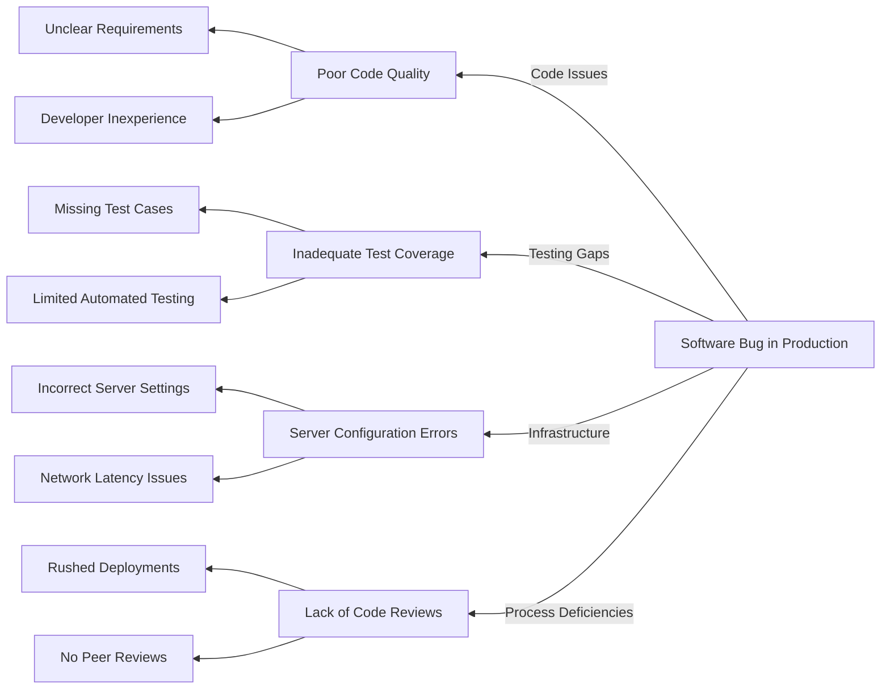

A **Cause-and-Effect Diagram** is a **visual representation** that helps trace an effect back to its **root cause**. It is commonly used in **problem-solving and quality management** to identify factors contributing to an issue. This diagram is also known as a **Fishbone Diagram** or **Ishikawa Diagram** due to its structure.

## Key Aspects of a Cause-and-Effect Diagram
- **Identifies Root Causes** – Helps teams analyze why a problem occurred.
- **Organizes Contributing Factors** – Groups causes into logical categories.
- **Improves Problem-Solving** – Provides a structured method to find solutions.
- **Common in Quality & Risk Management** – Used in Six Sigma, Lean, and process improvement.

## Structure of a Cause-and-Effect Diagram
- **Effect (Problem Statement)** – Placed at the right side of the diagram.
- **Main Cause Categories** – Branches representing major influencing factors.
- **Sub-Causes** – Additional breakdowns of each major cause.
- **Arrows Indicating Relationships** – Show how causes lead to the effect.

## Example Categories in a Fishbone Diagram
- **Manufacturing**: Materials, Methods, Machines, Manpower, Measurement, Environment.
- **Service Industry**: People, Policies, Procedures, Place, Technology.
- **Software Development**: Requirements, Code, Testing, Infrastructure, Security, Process.

## Example Scenario

### **Software Defect Investigation**
A software team analyzes a recurring **bug in production** using a cause-and-effect diagram:

### **Mermaid Diagram: Cause-and-Effect (Fishbone) Example**

## Cause-and-Effect Table

| Main Cause Category     | Sub-Cause |
|------------------------|--------------------------------|
| **Code Issues**        | Unclear Requirements |
|                        | Developer Inexperience |
| **Testing Gaps**       | Missing Test Cases |
|                        | Limited Automated Testing |
| **Infrastructure**     | Incorrect Server Settings |
|                        | Network Latency Issues |
| **Process Deficiencies** | Rushed Deployments |
|                        | No Peer Reviews |

## Why Cause-and-Effect Diagrams Matter

- Enhance Root Cause Analysis – Helps teams pinpoint the underlying reasons for problems.
- Improve Quality Control – Supports defect prevention and process optimization.
- Facilitate Team Collaboration – Encourages cross-functional analysis.
- Support Risk Mitigation – Identifies weaknesses before they cause major issues.

See also: [[Root Cause Analysis]], [[Risk Mitigation]], [[Process Improvement]], [[Failure Mode and Effects Analysis (FMEA)]].