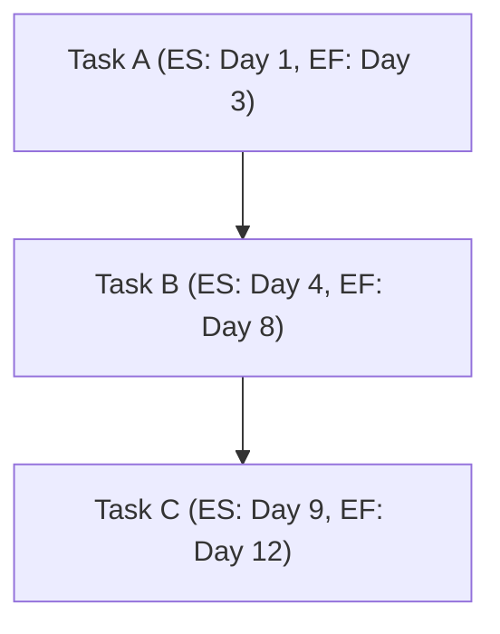

The **Early Start Date (ES)** is the **earliest possible point in time** when the uncompleted portions of a schedule activity **can start**, based on the **schedule network logic, the data date, and any schedule constraints**. It is determined using the **Critical Path Method (CPM)** through a **forward pass calculation**.

## **Key Aspects of the Early Start Date**
- **Determines the Earliest Task Start** – Accounts for dependencies and constraints.
- **Calculated Using the Forward Pass** – Helps establish the project timeline.
- **Affects the Overall Project Schedule** – Delays in ES impact the completion date.
- **Works in Conjunction with Early Finish Date** – Defines the start of a task while EF defines the earliest completion.

## **Early Start Calculation**
The formula for determining Early Start (ES) is:
$$
ES = Earliest Finish of Predecessor + 1
$$
Where:
- **ES** = Early Start Date
- **EF (Earliest Finish of Predecessor)** = The earliest possible finish date of the preceding task.

## **Example Calculation**
| **Activity** | **Duration (Days)** | **Early Start (ES)** | **Early Finish (EF)** |
|-------------|-----------------|----------------|----------------|
| Task A      | 3               | Day 1          | Day 3          |
| Task B      | 5               | Day 4          | Day 8          |
| Task C      | 4               | Day 9          | Day 12         |

For **Task A**:
$$
ES = 1
$$

For **Task B** (which starts right after Task A finishes):
$$
ES = 3 + 1 = 4
$$

## **Mermaid Diagram: Early Start in a Project Schedule**

## **Example Scenarios**

### **Software Development**
A **feature implementation task** must begin early to **align with testing schedules**. The **early start date determines resource allocation**.

### **Construction Project**
A **steel frame installation** must **start as early as possible** after foundation work is complete to **prevent project delays**.

### **Event Planning**
The **early start date for vendor setup** ensures that **staging and decorations are completed before rehearsals**.

## **Why Early Start Date Matters**
- **Defines Project Scheduling Logic** – Ensures tasks start at the right time.
- **Affects Project Deadlines** – Delays in ES push back the completion date.
- **Optimizes Resource Allocation** – Helps ensure teams and materials are available.
- **Supports Critical Path Analysis** – Helps determine scheduling flexibility.

See also: [[Early Finish Date (EF)]], [[Late Start Date (LS)]], [[Late Finish Date (LF)]], [[Schedule Network Analysis]], [[Critical Path Method (CPM)]].
