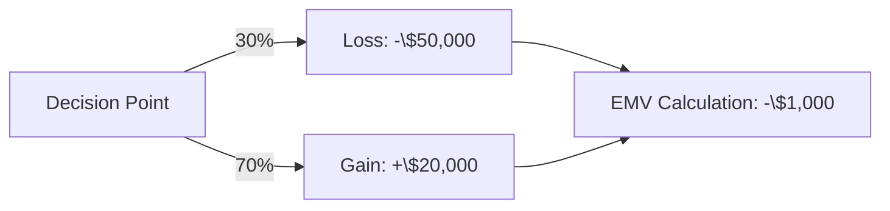

**Expected Monetary Value (EMV)** is the **estimated value of an outcome expressed in monetary terms**. It is used in **risk analysis and decision-making** to quantify the potential financial impact of uncertain events.

## **Key Aspects of Expected Monetary Value**
- **Calculates Risk Impact in Financial Terms** – Helps assess potential gains and losses.
- **Supports Decision Analysis** – Used in cost-benefit analysis and risk response planning.
- **Applies Probabilities to Outcomes** – Assigns likelihood to different scenarios.
- **Used in Monte Carlo Simulations** – Helps forecast financial uncertainty.

## **EMV Calculation Formula**
$$
EMV = \sum (P_i \times V_i)
$$
Where:
- **EMV** = Expected Monetary Value
- **P** = Probability of each outcome
- **V** = Monetary value of each outcome

## **Example Calculation**
A project has two possible risk outcomes:
1. **Risk A**: 30% probability of a **\$50,000 loss**
2. **Risk B**: 70% probability of a **\$20,000 gain**

$$
EMV = (0.3 \times -50,000) + (0.7 \times 20,000)
$$
$$
EMV = -15,000 + 14,000 = -1,000
$$

Since the **EMV is -\$1,000**, this project has a slight **negative expected financial impact**, meaning risk mitigation should be considered.

## **Mermaid Diagram: EMV Decision Tree**

## **Example Scenarios**

### **Software Development**
A company considers **outsourcing development** and calculates **EMV** to weigh the risks of **delays, cost overruns, and potential savings**.

### **Construction Project**
A contractor **evaluates the financial impact of weather delays** by estimating **EMV based on historical probabilities**.

### **Marketing Campaign**
A team **assesses advertising investment risks** by calculating **EMV for different market response rates**.

## **Why Expected Monetary Value Matters**
- **Enhances Risk-Based Decision-Making** – Helps evaluate financial implications of uncertainty.
- **Quantifies Potential Project Outcomes** – Translates risk into measurable financial terms.
- **Supports Cost-Benefit Analysis** – Ensures investments align with business goals.
- **Improves Project Financial Planning** – Helps allocate contingency reserves effectively.

See also: [[Risk Management]], [[Monte Carlo Simulation]], [[Cost-Benefit Analysis (CBA)]], [[Probability and Impact Matrix]].
