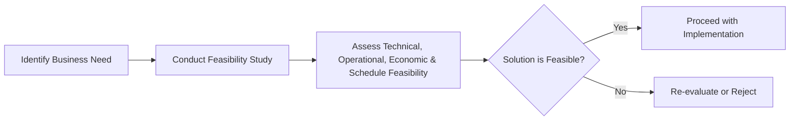

**Feasibility Analysis** is a **study that evaluates potential solutions** to determine their viability in **addressing business needs**. It examines **operational, technological, financial, and timeline feasibility** before making recommendations.

## **Key Aspects of Feasibility Analysis**
- **Assesses Solution Viability** – Determines if a project is realistic and achievable.
- **Examines Multiple Factors** – Includes cost, technology, operations, and time constraints.
- **Supports Go/No-Go Decisions** – Helps stakeholders decide whether to proceed.
- **Reduces Risk & Uncertainty** – Identifies potential challenges early in planning.

## **Types of Feasibility**
| **Type**                 | **Description** |
|--------------------------|------------------------------------------------|
| **Operational Feasibility** | Evaluates whether the solution aligns with business workflows. |
| **Technical Feasibility** | Assesses whether the required technology exists or is implementable. |
| **Economic Feasibility** | Examines cost-effectiveness and return on investment (ROI). |
| **Schedule Feasibility** | Determines if the project can be completed within required timelines. |

## **Example Scenarios**

### **Software Development**
A company conducts a **technical feasibility study** before integrating **AI-driven analytics** into its customer support system.

### **Construction Project**
A **real estate developer** performs an **economic feasibility analysis** to assess whether a **new residential complex** is financially viable.

### **Marketing Strategy**
A business evaluates **operational feasibility** before **launching a global rebranding campaign** across multiple markets.

## **Mermaid Diagram: Feasibility Analysis Process**

## Why Feasibility Analysis Matters

- Ensures Resource Efficiency – Prevents investment in unviable projects.
- Minimizes Risks – Identifies constraints before execution.
- Supports Strategic Decision-Making – Helps stakeholders make informed choices.
- Improves Project Success Rate – Ensures solutions align with business capabilities.

See also: [[Cost-Benefit Analysis (CBA)]], [[Risk Assessment]], [[Stakeholder Analysis]], [[Business Case Development]].