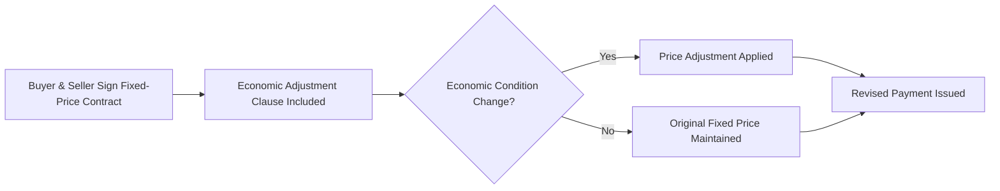

A **Fixed-Price with Economic Price Adjustment (FPEPA) Contract** is a **fixed-price contract that includes a provision allowing for predefined adjustments to the price** due to **external economic conditions**, such as **inflation, currency fluctuations, or changes in material costs**. This contract protects both buyers and sellers from unpredictable cost changes.

## **Key Aspects of FPEPA Contracts**
- **Fixed Base Price** – The contract sets an initial agreed-upon amount.
- **Adjustment Mechanism** – Price adjustments are triggered by predefined conditions.
- **Protects Against Inflation & Cost Fluctuations** – Ensures fair compensation for economic changes.
- **Common in Long-Term Contracts** – Used when cost uncertainty is a major factor.

## **Triggers for Price Adjustments**
| **Adjustment Factor** | **Description** |
|----------------------|------------------------------------------------|
| **Inflation Rate Changes** | Adjustments based on changes in the Consumer Price Index (CPI). |
| **Raw Material Cost Variability** | Price modifications for key commodities like steel, oil, or electronics. |
| **Exchange Rate Fluctuations** | Compensation for currency value shifts in international contracts. |
| **Regulatory & Tax Adjustments** | Price changes due to new government policies or tariffs. |

## **Example Scenarios**

### **Construction Project**
A **contract for building materials** includes a provision that **adjusts costs annually based on steel price fluctuations**.

### **Manufacturing Agreement**
A **supplier agreement for microchips** allows price adjustments **if semiconductor prices increase beyond 10%**.

### **Government Defense Contract**
A **military aircraft contract** adjusts pricing based on **fuel cost index changes over a 5-year period**.

## **Mermaid Diagram: FPEPA Contract Flow**

## Why Fixed-Price with Economic Price Adjustment Contracts Matter

- Protects Buyers & Sellers from Market Volatility – Reduces financial uncertainty.
- Ensures Fair Pricing Over Time – Adjusts for inflation and commodity price shifts.
- Supports Long-Term Agreements – Encourages stability in multi-year contracts.
- Balances Risk & Flexibility – Prevents excessive losses due to unpredictable cost changes.

See also: [[Firm-Fixed-Price (FFP) Contract]], [[Fixed-Price Incentive-Fee (FPIF) Contract]], [[Procurement Management]], [[Risk Management]].