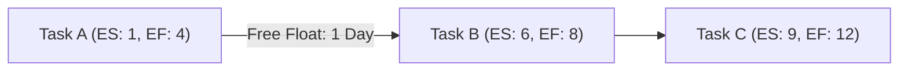

**Free Float** is the **amount of time that a schedule activity can be delayed without delaying the early start (ES) of any successor activity** or violating a schedule constraint. It helps project managers identify **flexibility within a schedule** while ensuring no impact on dependent tasks.

## **Key Aspects of Free Float**
- **Measures Task Flexibility** – Determines how much an activity can be delayed without affecting successors.
- **Does Not Impact Project Completion** – Unlike total float, free float does not delay the overall schedule.
- **Useful for Resource Optimization** – Helps in reassigning resources without causing timeline issues.
- **Relevant in Non-Critical Path Activities** – Typically applies to tasks **not on the critical path**.

## **Formula for Free Float**
$$
Free\ Float = ES_{successor} - EF_{current} - 1
$$
Where:
- **ES_successor** = Early Start of the successor task
- **EF_current** = Early Finish of the current task

## **Example Calculation**
| **Task** | **Duration** | **Early Start (ES)** | **Early Finish (EF)** | **Successor ES** | **Free Float (FF)** |
|---------|------------|-----------------|-----------------|-----------------|-----------------|
| **A**  | 4 days    | 1               | 4               | 6               | **1 day**       |
| **B**  | 3 days    | 5               | 7               | 8               | **0 days**      |

- **Task A has 1 day of Free Float** (since Task B starts at day 6, and Task A finishes at day 4).
- **Task B has 0 Free Float** (must start immediately after Task A to stay on track).

## **Mermaid Diagram: Free Float Visualization**

## Why Free Float Matters

- Improves Scheduling Flexibility – Identifies opportunities to adjust timelines.
- Prevents Unnecessary Task Delays – Helps teams prioritize tasks efficiently.
- Enhances Resource Allocation – Frees up resources for other work without impacting schedules.
- Supports Critical Path Analysis – Helps differentiate between float types in scheduling.

See also: [[Total Float]], [[Critical Path]], [[Near-Critical Activity]], [[Near-Critical Path]], [[Schedule Network Diagram]].