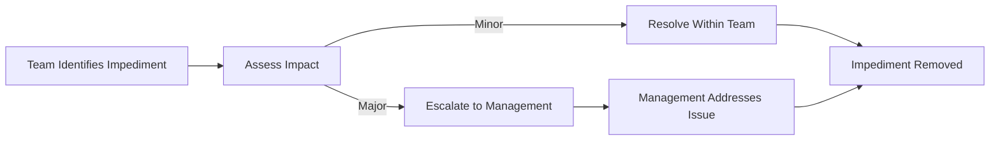

## **Impediment**
An **impediment** is an **obstacle that prevents the team from achieving its objectives**. It **hinders progress**, delays work, or introduces inefficiencies that must be resolved for the project to continue smoothly. Impediments are often **identified in Agile frameworks**, such as Scrum, where teams proactively work to remove them.

> **Also known as:** [[Blocker]]

### **Key Aspects of Impediments**
- **Can Be Internal or External** – May arise from organizational, technical, or stakeholder-related issues.
- **Impacts Productivity & Efficiency** – Directly affects the team's ability to meet objectives.
- **Requires Timely Resolution** – Must be escalated or addressed promptly to prevent delays.
- **Tracked in Agile Meetings** – Commonly discussed in **daily standups** or **retrospectives**.

### **Common Types of Impediments**
| **Category**         | **Example** |
|----------------------|------------------------------------------------|
| **Organizational**   | Lack of executive support, unclear priorities, or bureaucracy. |
| **Technical**        | Code integration failures, dependency issues, or broken environments. |
| **Resource-Based**   | Insufficient staffing, lack of access to tools, or missing expertise. |
| **Process-Related**  | Inefficient workflows, excessive approvals, or unclear requirements. |

### **Example Scenarios**

#### **Software Development**
- **Impediment:** A **critical API dependency** is not ready.
- **Impact:** Developers **cannot proceed** with feature integration.
- **Resolution:** Escalate to the API team for prioritization.

#### **Construction Project**
- **Impediment:** **Delayed material shipment** from a supplier.
- **Impact:** Work **on-site is halted**, leading to project delays.
- **Resolution:** Identify alternative suppliers or adjust schedules.

#### **Agile Team Workflow**
- **Impediment:** **Stakeholders delay feedback** on user stories.
- **Impact:** Developers **lack direction**, slowing down sprints.
- **Resolution:** Set clear stakeholder response deadlines.

### **Mermaid Diagram: Impediment Resolution Flow**

## Why Impediments Matter

- Ensures Continuous Progress – Removes barriers that slow down work.
- Enhances Team Collaboration – Encourages transparency and shared problem-solving.
- Supports Agile & Lean Methodologies – Focuses on efficiency and adaptability.
- Reduces Risk of Project Failure – Prevents small issues from escalating.

See also: [[Blocker]], [[Risk Management]], [[Daily Coordination Meeting]], [[Sprint Retrospective]].