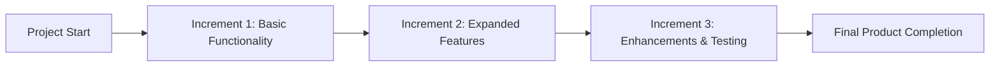

## **Incremental Approach**
An **Incremental Approach** is an **adaptive development method** where the **deliverable is produced in successive increments**, adding functionality over time until it **contains the necessary and sufficient capability to be considered complete**. This approach allows for **continuous progress and early value delivery** while refining the final product.

### **Key Aspects of the Incremental Approach**
- **Builds in Stages** – The product evolves through successive releases.
- **Delivers Partial but Usable Outputs** – Each increment adds functional components.
- **Supports Customer Feedback** – Early increments provide opportunities for refinement.
- **Common in Agile & Iterative Development** – Used in software, construction, and manufacturing.

### **Example Scenarios**

#### **Software Development**
- **Increment 1:** User login and authentication system.
- **Increment 2:** Profile management and user settings.
- **Increment 3:** Dashboard and reporting features.
- - **Final Deliverable:** A fully functional SaaS platform.

#### **Construction Project**
- **Increment 1:** Foundation and structural framework.
- **Increment 2:** Electrical, plumbing, and insulation.
- **Increment 3:** Interior finishes and landscaping.
- **Final Deliverable:** A completed and livable building.

#### **Marketing Campaign**
- **Increment 1:** Initial brand awareness ads.
- **Increment 2:** Customer engagement via social media.
- **Increment 3:** Retargeting and conversion strategies.
- **Final Deliverable:** A full-scale marketing campaign.

### **Mermaid Diagram: Incremental Approach Workflow**

## Why the Incremental Approach Matters

- Delivers Value Early – Customers get usable components before the full product is complete.
- Reduces Risk – Issues can be addressed in earlier increments rather than at the final release.
- Improves Stakeholder Engagement – Regular feedback loops enhance project alignment.
- Supports Agile & Iterative Workflows – Works well in environments where adaptability is crucial.

See also: [[Increment]], [[Iterative Approach]], [[Agile Development]], [[Minimum Viable Product (MVP)]], [[Sprint Review]].