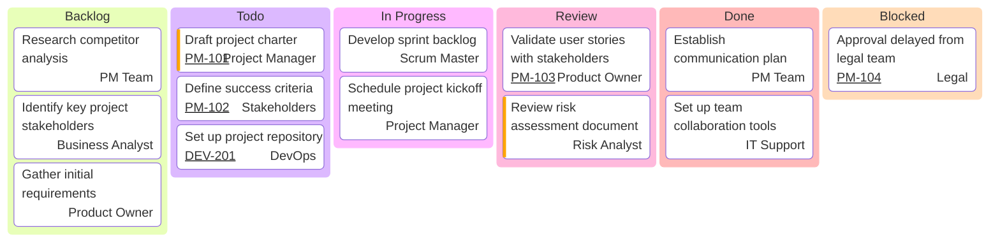

A **Kanban Board** is a **visual tool used to track work in progress, identify bottlenecks, and optimize workflow efficiency**. It provides teams with a clear view of task progression, helping to balance workloads and ensure a steady flow of work.

### **Key Aspects of a Kanban Board**
- **Visualizes Workflow** – Displays tasks in different stages, improving clarity and coordination.
- **Limits Work in Progress (WIP)** – Prevents teams from overloading by capping active tasks.
- **Enables Continuous Flow** – Unlike timeboxed methods, Kanban allows tasks to move forward as capacity permits.
- **Highlights Bottlenecks** – Shows where tasks are piling up, indicating process inefficiencies.
- **Pull-Based System** – New tasks are only started when there is available capacity, preventing overload.

### **Example Scenarios**

#### **Software Development**
- **Use Case:** Tracks software feature development.
- **Bottleneck Identified:** Too many tasks waiting for code review, causing slow releases.

#### **Marketing Campaign**
- **Use Case:** Organizes tasks for content creation and approvals.
- **Bottleneck Identified:** Delays in the design approval process slowing campaign rollout.

#### **Manufacturing Process**
- **Use Case:** Visualizes production stages for a manufacturing line.
- **Bottleneck Identified:** Supply chain delays holding up assembly work.

### **Mermaid Diagram: Kanban Workflow**

## Why a Kanban Board Matters

- Enhances Visibility – Ensures all team members and stakeholders have a clear view of progress.
- Improves Efficiency – Helps teams identify and remove inefficiencies.
- Supports Agile & Lean Practices – Encourages continuous delivery and flexibility.
- Encourages Collaboration – Keeps teams aligned and focused on priorities.

See also: [[Work in Progress (WIP)]], [[Agile Development]], [[Flow Efficiency]], [[Process Optimization]].