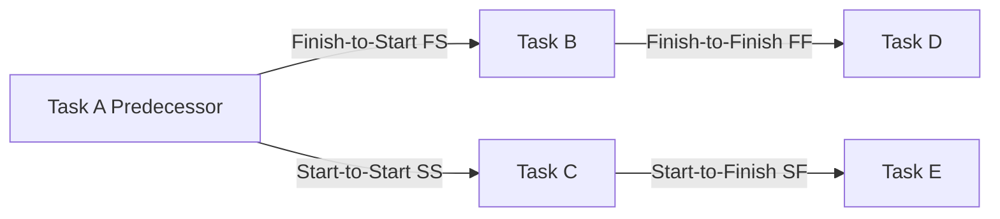

A **Logical Relationship** defines a **dependency between two activities or between an activity and a milestone** in a project schedule. It determines how tasks are sequenced and connected, influencing project flow and scheduling decisions.

### **Key Types of Logical Relationships**
- **Finish-to-Start (FS)** – The successor task cannot begin until the predecessor task finishes.
- **Finish-to-Finish (FF)** – The successor task cannot finish until the predecessor task finishes.
- **Start-to-Start (SS)** – The successor task cannot start until the predecessor task starts.
- **Start-to-Finish (SF)** – The successor task cannot finish until the predecessor task starts.

### **Example Scenarios**

#### **Software Development**
- **FS Example:** Testing cannot begin until coding is completed.
- **SS Example:** Frontend and backend development start simultaneously.

#### **Construction Project**
- **FF Example:** Electrical work must finish before final inspections can finish.
- **SF Example:** A shift handover cannot be completed until the next shift begins.

#### **Event Planning**
- **FS Example:** The event venue setup must be completed before guest registration starts.
- **FF Example:** Marketing efforts must continue until ticket sales conclude.

### **Mermaid Diagram: Logical Relationships in Scheduling**

## Why Logical Relationships Matter

- Defines Task Dependencies – Ensures proper sequencing of activities.
- Prevents Scheduling Conflicts – Helps avoid misaligned tasks and delays.
- Optimizes Project Flow – Facilitates efficient execution of work packages.
- Supports Critical Path Analysis – Essential for determining key project constraints.

See also: [[Finish-to-Finish (FF)]], [[Finish-to-Start (FS)]], [[Start-to-Start (SS)]], [[Start-to-Finish (SF)]], [[Schedule Dependencies]].

