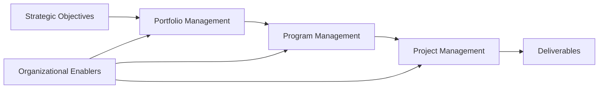

# Organizational Project Management (OPM)

**Organizational Project Management (OPM)** is a **framework that integrates portfolio, program, and project management with organizational enablers** to achieve strategic objectives. It ensures that all levels of work execution are aligned with the broader goals of the enterprise.

OPM connects strategic planning to delivery by enabling consistent practices, decision-making, and resource management across initiatives.

## Key Aspects of OPM

- **Integrated Framework** – Links projects, programs, and portfolios to strategy  
- **Driven by Enablers** – Utilizes organizational assets, culture, and capabilities  
- **Promotes Governance** – Aligns delivery with enterprise oversight  
- **Strategy Execution Engine** – Translates high-level vision into actionable work

## Example Scenarios

- A company uses OPM to align digital transformation initiatives across business units  
- Strategic goals are cascaded into portfolios, with programs and projects structured accordingly  
- Enterprise PMO governs execution through standard tools and decision gates

## Mermaid Diagram: OPM Strategic Alignment Flow

## Why Organizational Project Management Matters

- Enables Strategy Execution – Bridges long-term goals with project outcomes
- Improves Consistency – Standardizes delivery across organizational levels
- Strengthens Governance – Ensures alignment, control, and accountability
- Optimizes Resources – Enhances prioritization and performance tracking

See also: [[Portfolio Management]], [[Program Management]], [[Project Management]], [[Enterprise Environmental Factors (EEFs)]], [[Project Governance]].