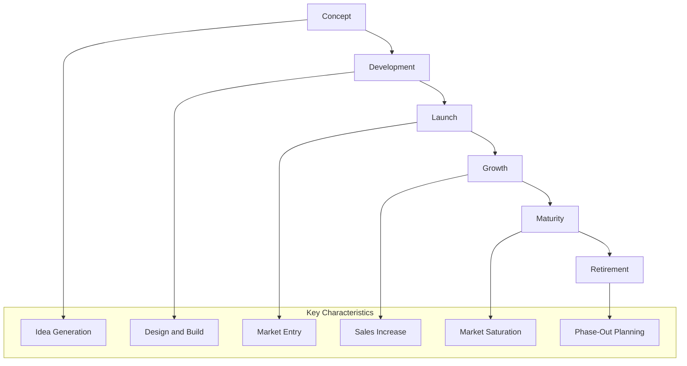

**Product Life Cycle** is a **series of phases** that represent the **evolution of a product**, beginning with its **concept**, progressing through **delivery**, **growth**, and **maturity**, and ending in **retirement**. Each phase reflects the product’s status in the market and influences decisions around investment, support, and improvement.

Understanding the product life cycle enables organizations to align strategy, resources, and operations with product performance over time.

## Key Characteristics

- **Phase-Based** – Includes concept, development, launch, growth, maturity, and retirement  
- **Market-Driven** – Informed by customer adoption, competition, and demand  
- **Strategy-Linked** – Supports decisions on investment, enhancement, and phase-out  
- **Lifecycle-Specific Planning** – Different phases require different approaches to resourcing and management

## Example Scenarios

- A new software tool is introduced, gains adoption, reaches peak use, and is eventually replaced  
- A physical product sees rapid sales growth, stabilizes in a saturated market, and is discontinued  
- A training curriculum is launched, updated annually, and retired when content becomes obsolete

## Mermaid Diagram: Product Life Cycle Phases and Dynamics

## Why Product Life Cycle Matters

- **Supports Strategic Planning** – Guides timing for updates, replacements, or discontinuation  
- **Enables Resource Alignment** – Adjusts support and investment across product stages  
- **Improves Market Responsiveness** – Helps adapt offerings to customer needs and competition  
- **Maximizes Value Delivery** – Informs decisions that extend usefulness and profitability

See also: [[Product]], [[Deliverable]], [[Lifecycle]], [[Strategic Alignment]], [[Benefits Management]].
