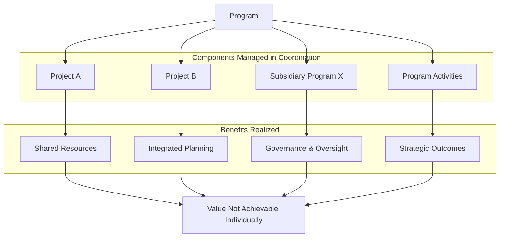

**Program** is a collection of **related projects, subsidiary programs, and program activities** that are **managed in a coordinated manner** to obtain **benefits not available from managing them individually**. Programs focus on delivering strategic outcomes through integrated planning, governance, and execution.

Programs provide structure and alignment for managing complex initiatives that share objectives, resources, stakeholders, or outcomes.

## Key Characteristics

- **Benefit-Oriented** – Designed to deliver value beyond the sum of parts  
- **Coordinated Management** – Synchronizes efforts across multiple components  
- **Dynamic Composition** – Can include projects, sub-programs, and operational activities  
- **Strategic Focus** – Aligned with enterprise goals and often sponsored at the executive level

## Example Scenarios

- A digital transformation program includes multiple tech modernization projects and business process changes  
- An infrastructure program manages transportation, utility, and safety projects under one initiative  
- A government health program includes public outreach, regulation, and service delivery components

## Mermaid Diagram: Program Structure and Relationships

## Why Programs Matters

- **Enables Synergy** – Coordinates efforts for efficiency and enhanced outcomes  
- **Improves Governance** – Provides unified oversight and risk control  
- **Supports Strategic Execution** – Bridges organizational goals and tactical delivery  
- **Optimizes Resource Use** – Shares personnel, funding, and tools across components

See also: [[Portfolio]], [[Project]], [[Program Management]], [[Strategic Alignment]], [[Governance]].
