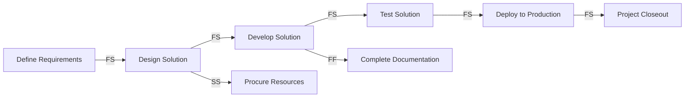

A **Project Schedule Network Diagram** is a **graphical representation of the logical relationships among the project schedule activities**. It visually maps how activities are connected based on dependencies and sequencing, enabling accurate scheduling, critical path analysis, and identification of project constraints.

This diagram is commonly built using the Precedence Diagramming Method (PDM) and is essential for understanding the project’s flow and timing.

## Key Characteristics

- **Dependency-Driven** – Shows finish-to-start, start-to-start, finish-to-finish, or start-to-finish relationships  
- **Logic-Based Sequencing** – Represents how activities are ordered and interrelated  
- **Supports Critical Path Analysis** – Identifies paths that determine the project duration  
- **Graphical Format** – Used in scheduling tools and for stakeholder communication

## Example Scenarios

- A product launch schedule includes design, development, testing, and deployment with clear dependencies  
- A construction schedule diagram shows how permitting must finish before excavation can start  
- A marketing campaign schedule visually links content creation, review, and publication timelines

## Example Project Schedule Network Diagram

## Role in Scheduling

- **Improves Clarity** – Makes complex sequencing more understandable  
- **Supports Accurate Forecasting** – Helps estimate durations and identify risks  
- **Enables Optimization** – Highlights opportunities for parallel work or crashing  
- **Facilitates Planning and Control** – Essential for creating and managing the project schedule

See also: [[Node]], [[Precedence Diagramming Method]], [[Logical Relationship]], [[Schedule Model]], [[Critical Path Method (CPM)]].
