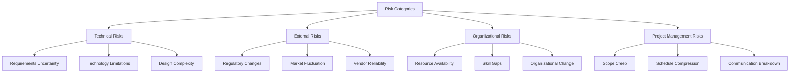

A **Risk Breakdown Structure** is a hierarchical representation of potential sources of risk.

It categorizes risks into structured levels, enabling project teams to systematically identify, group, and analyze risks by origin or area of impact. This structure enhances risk visibility and supports more focused risk planning and response efforts.

## Key Characteristics

- **Hierarchical Format** – Organizes risks from broad categories to specific sources  
- **Supports Risk Identification** – Encourages comprehensive review of risk areas  
- **Enables Risk Grouping** – Facilitates analysis and prioritization by category  
- **Tailorable** – Can be customized to fit the context of the project or organization  

## Example Scenarios

- Categorizing risks under technical, external, and organizational domains during planning  
- Analyzing risk exposure by source area to focus mitigation strategies  
- Using the structure to assign risk ownership by category  

## Example Risk Breakdown Structure

## Role in Risk Management

- **Improves Risk Coverage** – Ensures diverse sources of risk are considered  
- **Enhances Communication** – Clarifies risk origin for stakeholders  
- **Guides Response Planning** – Supports targeted strategy development per risk group  
- **Feeds Into Risk Register** – Helps organize and maintain structured risk records  

See also: [[Organizational Breakdown Structure]], [[Resource Breakdown Structure]], [[Work Breakdown Structure]], [[Risk Register]], [[Risk Category]].
