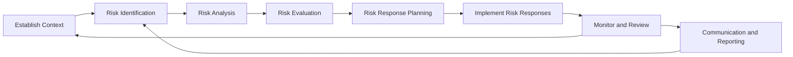

A **Risk Management Framework** (RMF) is a structure that organizes the process and activities of managing risks in an iterative fashion.

It establishes a consistent and repeatable approach to identifying, analyzing, responding to, and monitoring risks, ensuring alignment with organizational goals and integration across project or program lifecycles.

## Key Characteristics

- **Process-Oriented** – Defines distinct, repeatable risk management steps  
- **Iterative and Cyclical** – Applied continuously throughout the project or portfolio  
- **Organizationally Aligned** – Supports enterprise-wide risk governance  
- **Foundation for Integration** – Links with planning, execution, and control processes  

## Example Scenarios

- Applying a risk framework across a portfolio to standardize reporting and response  
- Using the framework to evaluate and track strategic risks during business case development  
- Incorporating the framework into PMO standards for all program-level reviews  

## Example Mermaid Diagram of an RMF

## Role in Risk Governance

- **Ensures Consistency** – Standardizes how risks are handled across initiatives  
- **Improves Visibility** – Provides structure for escalation and oversight  
- **Strengthens Resilience** – Supports proactive and responsive risk handling  
- **Aligns Practices** – Connects operational risk management to strategic objectives  

See also: [[Risk Management Plan]], [[Risk Register]], [[Monitor Risks]], [[Governance]], [[Risk Strategy]].
