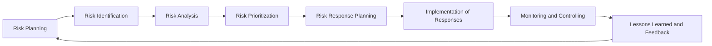

**Risk Management Life Cycle** is a structured approach for undertaking a comprehensive view of risk throughout the enterprise, portfolio, program, and project domains.

It defines the full set of recurring, integrated risk activities from initial identification through monitoring and control, ensuring that risks are actively managed across all levels and stages of work.

## Key Characteristics

- **Comprehensive Scope** – Spans strategic and operational risk domains  
- **Stage-Based** – Follows defined sequential or iterative phases  
- **Cross-Level Integration** – Applied at enterprise, portfolio, program, and project levels  
- **Supports Continuous Improvement** – Promotes feedback and adaptation over time  

## Example Scenarios

- Executing risk life cycle activities across multiple projects under a program  
- Applying enterprise-level risk governance while managing individual project threats  
- Establishing repeatable processes for risk escalation and resolution  

## Example of a Risk Management Life Cycle

## Role in Risk Governance

- **Promotes Standardization** – Aligns risk activities across organizational layers  
- **Ensures End-to-End Oversight** – Covers full risk evolution from planning to closure  
- **Improves Traceability** – Enables audit and evaluation of risk handling effectiveness  
- **Reinforces Accountability** – Assigns clear roles and responsibilities throughout  

See also: [[Risk Management Framework]], [[Monitor Risks]], [[Risk Register]], [[Risk Response Plan]], [[Risk Strategy]].
