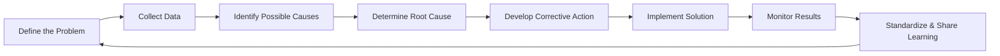

**Root Cause Analysis** is an analytical method used to determine the basic underlying reason that causes a variance, defect, or risk.

It identifies the origin of a problem by examining the contributing factors in depth, enabling effective corrective actions that address the source rather than just the symptoms.

## Key Characteristics

- **Causality-Focused** – Traces issues back to their true origin  
- **Fact-Based** – Uses data and evidence to support conclusions  
- **Prevention-Oriented** – Aims to eliminate recurrence through corrective action  
- **Widely Applicable** – Used across risk, quality, scope, and schedule domains  

## Example Scenarios

- Investigating why a critical path task was delayed beyond float tolerance  
- Analyzing recurring product defects to identify process weaknesses  
- Determining the underlying cause of a budget overrun due to resource conflicts  

## Example Root Cause Analysis Cycle

## Role in Project and Quality Management

- **Supports Corrective Actions** – Ensures responses address root causes, not symptoms  
- **Improves Process Maturity** – Strengthens systems by eliminating fundamental failures  
- **Reduces Recurrence** – Prevents repeated issues that impact performance  
- **Feeds Lessons Learned** – Contributes to organizational knowledge and future planning  

See also: [[Variance Analysis]], [[Defect Repair]], [[Lessons Learned Register]], [[Corrective Action]], [[Monitor and Control Project Work]].
