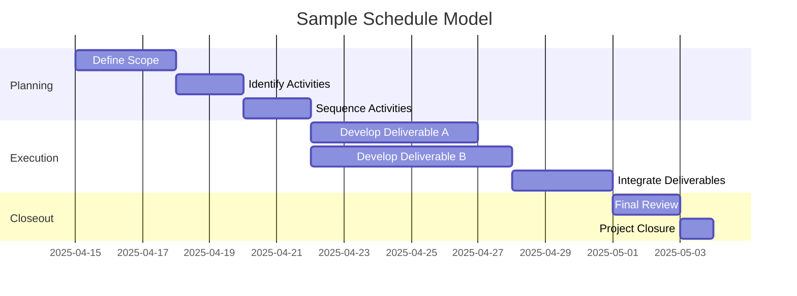

A **Schedule Model** is a representation of the plan for executing project activities, including their sequencing, durations, dependencies, and constraints.

It serves as the basis for creating and maintaining the project schedule, using defined inputs such as activity lists, resource requirements, and calendars to calculate planned dates for tasks and milestones.

## Key Characteristics

- **Structured Representation** – Built from activities, logic, durations, and calendars  
- **Supports Schedule Baseline Creation** – Used to derive the approved project timeline  
- **Dynamic and Updatable** – Adjusted as changes occur or more detail becomes available  
- **Used for Forecasting and Control** – Informs progress measurement, scenario planning, and reporting  

## Example Scenarios

- Building a project timeline in scheduling software using activity durations and dependencies  
- Modeling alternate sequencing options to analyze schedule compression impact  
- Updating the model to reflect approved change requests or actual progress  

## Example of a Schedule Model

## Role in Project Scheduling

- **Enables Accurate Planning** – Converts scope into a time-based execution plan  
- **Supports Decision-Making** – Allows evaluation of scheduling alternatives  
- **Integrates with Other Plans** – Coordinates with cost, resource, and risk management  
- **Forms Basis for Monitoring** – Tracks actual performance against modeled expectations  

See also: [[Schedule Baseline]], [[Schedule Management Plan]], [[Activity List]], [[Milestone]], [[Work Breakdown Structure]].
