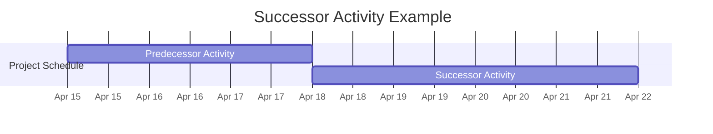

A **Successor Activity** is a dependent activity that logically comes after another activity in a schedule.

It is linked to a predecessor activity through a logical relationship that dictates the order in which tasks are performed. The timing and sequencing of the successor are determined by the relationship type—such as finish-to-start or start-to-start—which governs how and when the successor may begin or end relative to its predecessor.

## Key Characteristics

- **Dependent Sequence** – Follows another activity in the schedule  
- **Controlled by Logical Relationships** – May start or finish based on the predecessor’s progress  
- **Part of the Schedule Network** – Integral to critical path and float calculations  
- **Supports Structured Planning** – Helps define realistic, constraint-based task flows  

## Example Scenarios

- Testing (successor) cannot begin until development (predecessor) is complete  
- Data import (successor) starts as soon as the system setup (predecessor) begins  
- Deployment (successor) finishes only after final approval (predecessor) starts  

## Example Successor Activity

## Role in Project Scheduling

- **Enables Dependency Modeling** – Clarifies execution order and coordination  
- **Supports Critical Path Analysis** – Helps identify time-sensitive chains of activities  
- **Drives Task Timing** – Successor start and finish dates depend on predecessor status  
- **Feeds Performance Tracking** – Helps analyze schedule variance and forecast delays  

See also: [[Predecessor Activity]], [[Summary Activity]], [[Logical Relationship]], [[Start-to-Start]], [[Finish-to-Start]].
