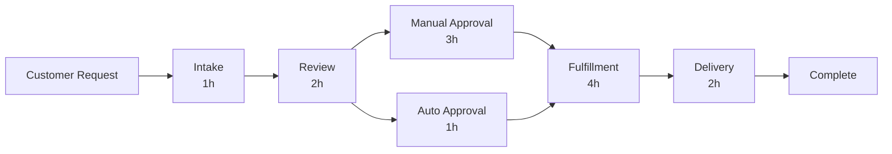

A **Value Stream Map** is a display of the critical steps in a process and the time taken in each step used to identify waste.

It visually represents the flow of work, information, and time through a process, highlighting bottlenecks, inefficiencies, and opportunities for improvement. Value stream mapping is a core technique in Lean and Agile practices, used to optimize end-to-end value delivery.

## Key Characteristics

- **Flow-Based Visualization** – Represents the sequence of steps from request to delivery  
- **Time-Tracked** – Annotates cycle times or wait times at each step  
- **Highlights Waste** – Identifies delays, rework, and non-value-adding activities  
- **Supports Continuous Improvement** – Guides teams in streamlining workflows  

## Example Scenarios

- Mapping the software delivery process from feature request to deployment  
- Analyzing a procurement process to reduce handoff delays and approvals  
- Optimizing the onboarding flow for new employees or customers  

## Example Value Stream Map

## Role in Process Optimization

- **Increases Transparency** – Makes inefficiencies visible across departments  
- **Enables Data-Driven Change** – Uses cycle times and paths to justify improvements  
- **Aligns Teams Around Flow** – Focuses stakeholders on customer value and throughput  
- **Drives Lean Thinking** – Encourages elimination of waste and delays  

See also: [[Process Improvement Plan]], [[Lean]], [[Cycle Time]], [[Work in Progress (WIP)]], [[Continuous Improvement]].
