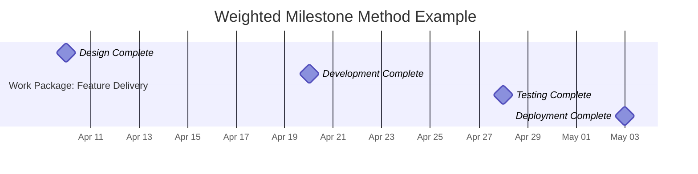

**Weighted Milestone Method** is a method of estimating earned value in which the budget value of a work package is divided into measurable segments, each ending with a milestone that is assigned a weighted budget value.

This method allows for more accurate performance tracking in long-duration or complex work packages by assigning earned value incrementally as milestones are completed, rather than all at once.

## Key Characteristics

- **Milestone-Based** – Tied to physical, measurable completion points  
- **Incremental Earned Value** – EV increases with each milestone achieved  
- **Weight-Driven** – Each milestone has a predefined percentage of the total budget  
- **Improves Progress Visibility** – Especially effective for multi-phase or high-value tasks  

## Example Scenarios

- A construction work package broken into milestones: site prep, foundation, framing, and roofing  
- A software feature with milestones for design, development, testing, and deployment  
- A research task with defined phases like literature review, analysis, and reporting  

## Example Table: Weighted Milestone Breakdown

| Milestone             | Description            | Weight (%) | Budget Value ($) | Cumulative EV When Complete ($) |
|-----------------------|------------------------|------------|------------------|----------------------------------|
| M1                    | Design Complete         | 20%        | 2,000            | 2,000                            |
| M2                    | Development Complete    | 40%        | 4,000            | 6,000                            |
| M3                    | Testing Complete        | 30%        | 3,000            | 9,000                            |
| M4                    | Deployment Complete     | 10%        | 1,000            | 10,000                           |

## Example Weighted Milestone Method

## Role in Earned Value Management

- **Improves Accuracy** – More realistic progress measurement for staged work  
- **Strengthens Cost Forecasting** – Better input to EAC, VAC, and CPI calculations  
- **Enhances Oversight** – Enables visibility of partial completion in lengthy activities  
- **Reduces Risk of Overstatement** – Prevents claiming full value before actual delivery  

See also: [[Fixed Formula Method]], [[Earned Value (EV)]], [[Estimate at Completion (EAC)]], [[Work Package]], [[Milestone]].
