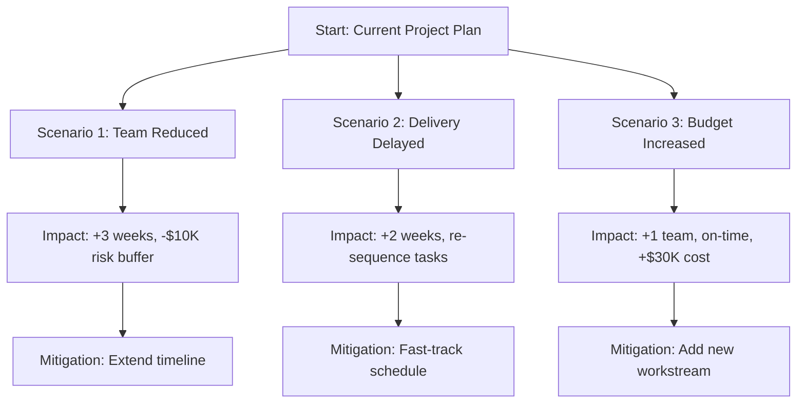

**What-If Scenario Analysis** is the process of evaluating scenarios in order to predict their effect on project objectives.

It examines possible outcomes under different sets of assumptions, constraints, or conditions to support proactive decision-making. This analysis helps project teams identify risks, assess trade-offs, and prepare contingency or response strategies based on forecasted impacts.

## Key Characteristics

- **Predictive Tool** – Explores the consequences of hypothetical events or choices  
- **Decision-Focused** – Informs responses to potential project deviations  
- **Scenario-Based** – Models multiple alternative paths or inputs  
- **Supports Risk and Schedule Management** – Often used to test impact of delays or scope changes  

## Example Scenarios

- Assessing how a two-week delay in material delivery would impact the finish date  
- Comparing cost impact of adding an extra team versus extending the timeline  
- Evaluating risk exposure if a critical supplier fails  

## Example What-if Scenario: Decision Tree

## Role in Forecasting and Risk Planning

- **Improves Preparedness** – Equips the team with options for high-impact risks  
- **Enhances Decision Quality** – Supports informed choices based on potential impact  
- **Strengthens Contingency Planning** – Tests whether current buffers or reserves are sufficient  
- **Feeds into Monte Carlo or Schedule Simulations** – Often used with quantitative analysis tools  

See also: [[Quantitative Risk Analysis]], [[Contingency Plan]], [[Monte Carlo Simulation]], [[Schedule Model Analysis]], [[Risk Response Planning]].
