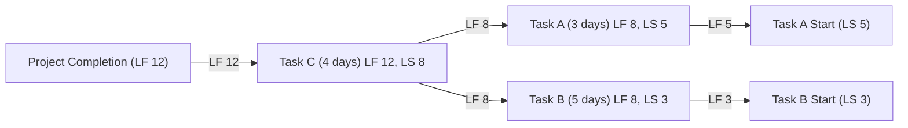

**Backward Pass** is a scheduling technique in the **Critical Path Method (CPM)** used to calculate the **late start (LS)** and **late finish (LF)** dates for activities by working backward from the project’s end date. It helps determine the latest possible time each task can start and finish without delaying the overall schedule.

## Key Aspects of Backward Pass
- **Works in Reverse** – Starts from the project's last activity and moves backward.
- **Determines Late Start & Finish** – Identifies the latest an activity can begin and end without affecting the project deadline.
- **Calculates Total Float** – Measures scheduling flexibility by comparing early and late start times.
- **Essential for Critical Path Analysis** – Ensures activities align with the overall project timeline.

## Backward Pass Formula
- **Late Finish (LF) = Minimum Late Start (LS) of Successor Activities**
- **Late Start (LS) = LF – Duration**
- If an activity has multiple successors, the **smallest LS** among them determines its LF.

## Example Scenario

A project consists of three tasks with the following durations:
- **Task A**: 3 days
- **Task B**: 5 days
- **Task C**: 4 days (dependent on Task A and Task B)
- **Project Completion Deadline**: **Day 12**

The **backward pass** starts from the project’s completion (LF = 12) and calculates backward.

### **Mermaid Diagram: Backward Pass Calculation**

## Calculated Late Start (LS) & Late Finish (LF)

| Task | Duration | Late Finish (LF) | Late Start (LS) |
|------|---------|-----------------|-----------------|
| C    | 4 days  | 12              | 8               |
| A    | 3 days  | 8               | 5               |
| B    | 5 days  | 8               | 3               |

## Why Backward Pass Matters

- **Identifies Critical Path** – Highlights tasks that directly impact the project deadline.
- **Optimizes Scheduling** – Ensures tasks start as late as possible without affecting successors.
- **Reveals Float** – Determines which tasks have flexibility and which are critical.

See also: [[Forward Pass]], [[Critical Path Method]], [[Schedule Network Analysis]], [[Total Float]].