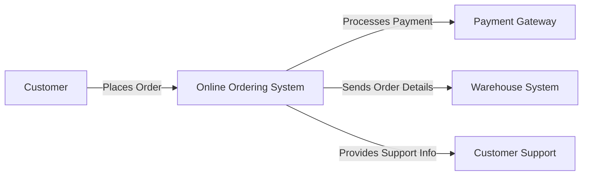

A **Context Diagram** is a **high-level visual representation** that shows how a system, process, or project interacts with **external entities** such as users, systems, or organizations. It provides a **big-picture view** without detailing internal workflows.

## Key Aspects of a Context Diagram
- **Shows System Boundaries** – Defines what is inside and outside the system.
- **Identifies External Entities** – Represents stakeholders, systems, or processes interacting with the system.
- **Illustrates Data Flow** – Displays the exchange of information or materials.
- **Provides a High-Level Overview** – Focuses on relationships rather than internal functionality.

## Components of a Context Diagram
- **System (Process or Project)** – The central element under analysis.
- **External Entities** – Users, organizations, or other systems interacting with the system.
- **Data or Process Flows** – The movement of information between entities and the system.

## Example Scenario

### **Online Ordering System**
A context diagram for an **e-commerce website** might include:
- **System:** Online Ordering Platform
- **External Entities:**
  - Customers (placing orders)
  - Payment Gateway (processing transactions)
  - Warehouse System (handling inventory)
  - Customer Support (handling inquiries)

### **Mermaid Diagram: Context Diagram Example**

Why Context Diagrams Matter

- Clarifies Scope & Boundaries – Helps define what is included in the system.
- Enhances Communication – Provides a simple, visual summary for stakeholders.
- Improves Requirements Gathering – Identifies interactions early in a project.
- Aids in System Design – Helps architects plan integrations and data flows.

See also: [[Process Flow Diagram]], [[Data Flow Diagram (DFD)]], [[Stakeholder Analysis]], [[System Architecture]].