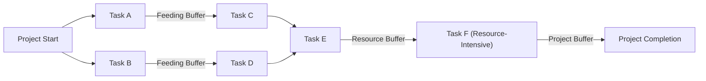

The **Critical Chain Method (CCM)** is a **schedule management technique** that places **buffers on project schedule paths** to **account for resource limitations and uncertainties**. It enhances **schedule reliability** by ensuring that key resources are available when needed.

## **Key Aspects of the Critical Chain Method**
- **Focuses on Resource Constraints** – Unlike the **Critical Path Method (CPM)**, which focuses on task dependencies, CCM prioritizes **resource availability**.
- **Uses Buffers to Absorb Delays** – Implements **project, feeding, and resource buffers** to mitigate risks.
- **Reduces Multitasking** – Encourages focused work by limiting parallel tasks.
- **Improves Schedule Stability** – Minimizes last-minute adjustments due to resource bottlenecks.

## **Types of Buffers in CCM**
| **Buffer Type**   | **Purpose** |
|-------------------|------------------------------------------------|
| **Project Buffer** | Placed at the end of the project to absorb overall delays. |
| **Feeding Buffer** | Added before non-critical tasks that feed into the critical chain. |
| **Resource Buffer** | Ensures critical resources are available when needed. |

## Critical Chain Method Example

## Diagram Explanation

- Task Paths: Multiple paths (A → C → E → F and B → D → E → F) represent parallel workflows.
- Feeding Buffers: Placed before merging paths (before C and D) to absorb delays in non-critical tasks.
- Resource Buffer: Added before Task F, a resource-intensive task, ensuring critical personnel/equipment are available.
- Project Buffer: Placed before Project Completion to protect the final deadline from cumulative delays.

## **Example Scenarios**

### **Software Development**
A software team **assigns a project buffer** to account for **testing delays**, ensuring that critical code review resources remain available.

### **Construction Project**
A **resource buffer is placed for crane operators** to prevent scheduling conflicts on multiple tasks requiring the same equipment.

### **Manufacturing**
A factory **adds feeding buffers** before **assembly line integration**, reducing the risk of component delays affecting final production.

## **Why the Critical Chain Method Matters**
- **Enhances Schedule Reliability** – Buffers reduce schedule disruptions.
- **Optimizes Resource Utilization** – Prevents bottlenecks caused by limited personnel or equipment.
- **Reduces Task Switching** – Encourages uninterrupted work on high-priority tasks.
- **Minimizes Risk of Schedule Overruns** – Proactively manages uncertainties.

See also: [[Critical Path Method (CPM)]], [[Schedule Buffer]], [[Resource Leveling]], [[Project Risk Management]].
