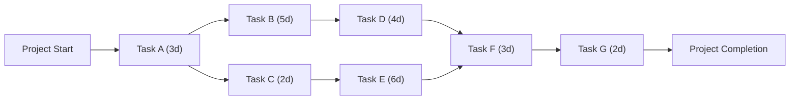

The **Critical Path** is the **sequence of activities that represents the longest path through a project**, determining the **shortest possible duration** for project completion. Any delay in a **critical path activity** directly impacts the project's finish date.

## **Key Aspects of the Critical Path**
- **Determines Project Duration** – Defines the minimum time needed to complete the project.
- **Identifies Critical Activities** – Tasks on the critical path cannot be delayed without extending the project timeline.
- **Has Zero Float (Slack)** – Critical tasks have no scheduling flexibility.
- **Used in the Critical Path Method (CPM)** – Helps in scheduling, resource allocation, and risk management.

## **Example Calculation of Critical Path**
| **Activity** | **Duration (Days)** | **Predecessor** |
|-------------|-----------------|----------------|
| A          | 3               | Start         |
| B          | 5               | A             |
| C          | 2               | A             |
| D          | 4               | B             |
| E          | 6               | C             |
| F          | 3               | D, E          |
| G (End)    | 2               | F             |

### **Critical Path Determination**
1. **Identify all paths through the project network.**
   - **Path 1**: A → B → D → F → G → **(Total: 3+5+4+3+2 = 17 days)**
   - **Path 2**: A → C → E → F → G → **(Total: 3+2+6+3+2 = 16 days)**

2. **Select the longest path.**
   - **Critical Path: A → B → D → F → G (17 days)**

## **Mermaid Diagram: Critical Path Example**

## Why the Critical Path Matters

- Defines the Minimum Project Duration – Helps set realistic completion deadlines.
- Highlights High-Risk Activities – Delays in critical path tasks directly impact the schedule.
- Aids in Resource Allocation – Focuses attention on critical activities requiring priority resources.
- Enables Proactive Schedule Management – Allows project teams to anticipate and mitigate potential delays.

See also: [[Critical Path Activity]], [[Critical Path Method (CPM)]], [[Schedule Network Diagram]], [[Total Float]].