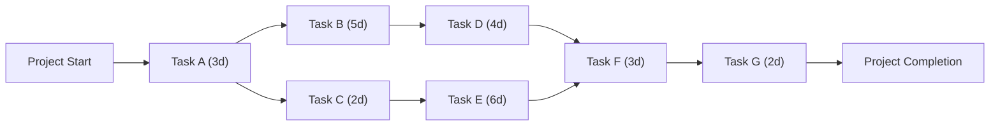

A **Critical Path Activity** is **any activity on the critical path** in a project schedule. These activities directly **impact the project's finish date** because they have **zero float (slack)**—meaning any delay will extend the overall project duration.

## **Key Aspects of a Critical Path Activity**
- **Essential for Project Completion** – Delays in these activities push back the entire project.
- **Has Zero Float** – No flexibility in scheduling.
- **Forms the Longest Path in the Project** – Determines the shortest possible project duration.
- **Requires Close Monitoring** – Must be tracked to prevent project overruns.

## **Example: Identifying Critical Path Activities**
| **Activity** | **Duration (Days)** | **Predecessor** | **On Critical Path?** |
|-------------|-----------------|----------------|----------------|
| A          | 3               | Start         | ✅ Yes |
| B          | 5               | A             | ✅ Yes |
| C          | 2               | A             | ❌ No |
| D          | 4               | B             | ✅ Yes |
| E          | 6               | C             | ❌ No |
| F          | 3               | D, E          | ✅ Yes |
| G (End)    | 2               | F             | ✅ Yes |

- **Critical Path**: **A → B → D → F → G (Total Duration: 17 days)**
- **Critical Path Activities**: **A, B, D, F, G**

## **Mermaid Diagram: Critical Path Activities**

## Why Critical Path Activities Matter

- Directly Impact the Project Deadline – Any delay in these tasks extends project completion.
- Require Priority Monitoring – High-risk tasks needing focused tracking.
- Help in Resource Allocation – Ensures critical tasks get necessary resources.
- Enable Proactive Risk Management – Identifies potential bottlenecks early.

See also: [[Critical Path]], [[Critical Path Method (CPM)]], [[Schedule Network Diagram]], [[Total Float]].