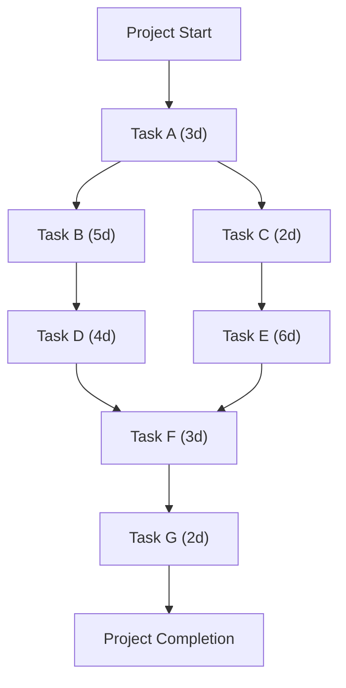

The **Critical Path Method (CPM)** is a **schedule analysis technique** used to **estimate the minimum project duration** and **determine the amount of scheduling flexibility (float/slack) across logical network paths** within the schedule model. It helps project managers identify **critical path activities** that must be closely monitored to ensure on-time project completion.

## **Key Aspects of the Critical Path Method**
- **Identifies the Longest Path in the Schedule** – Determines the shortest project duration.
- **Calculates Float (Slack) for Non-Critical Activities** – Measures schedule flexibility.
- **Uses Forward & Backward Pass Calculations** – Determines **Early Start (ES), Early Finish (EF), Late Start (LS), and Late Finish (LF)** for each task.
- **Aids in Resource Allocation & Risk Management** – Prioritizes critical activities to minimize delays.

## **Steps in the Critical Path Method**
1. **List All Activities** – Identify all project tasks.
2. **Define Dependencies** – Establish which tasks depend on others.
3. **Estimate Activity Durations** – Assign a time estimate to each task.
4. **Draw a Schedule Network Diagram** – Visually map out task dependencies.
5. **Perform Forward Pass Calculation** – Determine **Early Start (ES) and Early Finish (EF)** times.
6. **Perform Backward Pass Calculation** – Calculate **Late Start (LS) and Late Finish (LF)** times.
7. **Identify the Critical Path** – The longest path with **zero float**.

## **Example: CPM Calculation**
| **Activity** | **Duration (Days)** | **Predecessor** | **ES** | **EF** | **LS** | **LF** | **Float** |
|-------------|-----------------|----------------|------|------|------|------|------|
| A          | 3               | Start         | 0    | 3    | 0    | 3    | 0    |
| B          | 5               | A             | 3    | 8    | 3    | 8    | 0    |
| C          | 2               | A             | 3    | 5    | 6    | 8    | 3    |
| D          | 4               | B             | 8    | 12   | 8    | 12   | 0    |
| E          | 6               | C             | 5    | 11   | 8    | 14   | 3    |
| F          | 3               | D, E          | 12   | 15   | 12   | 15   | 0    |
| G (End)    | 2               | F             | 15   | 17   | 15   | 17   | 0    |

- **Critical Path**: **A → B → D → F → G (Total Duration: 17 days)**
- **Float (Slack)**: Non-critical tasks (**C** and **E**) have **float values**, meaning they can be delayed **without impacting the overall project timeline**.

## **Mermaid Diagram: Critical Path Method Example**

## Why the Critical Path Method Matters

- Defines the Minimum Project Duration – Helps project managers set realistic deadlines.
- Identifies Critical Activities – Highlights tasks that must be completed on time.
- Calculates Float (Slack) for Non-Critical Tasks – Shows which activities can be delayed without affecting the schedule.
- Aids in Risk & Resource Management – Ensures high-priority activities receive adequate resources.

See also: [[Critical Path]], [[Critical Path Activity]], [[Schedule Network Diagram]], [[Total Float]].