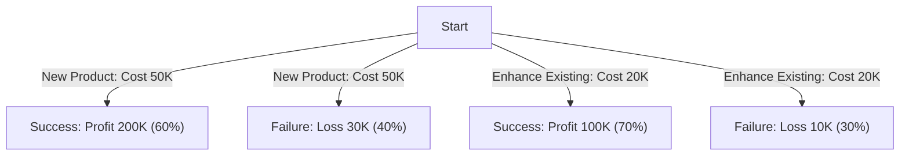

**Decision Tree Analysis** is a **diagramming and calculation technique** used to **evaluate multiple options** in the presence of **uncertainty**. It helps project managers **visualize different decision paths, assess risks, and calculate expected outcomes** to make informed choices.

## **Key Aspects of Decision Tree Analysis**
- **Models Uncertain Outcomes** – Represents different decision paths and possible results.
- **Quantifies Risk & Rewards** – Assigns probabilities and costs to each scenario.
- **Uses Expected Value Calculations** – Helps identify the most beneficial choice.
- **Supports Strategic Decision-Making** – Commonly applied in risk assessment and project planning.

## **Example Decision Tree**
A company must choose between **Developing a New Product** or **Enhancing an Existing Product**. Each choice has **potential success or failure scenarios**, with associated costs and probabilities.

### **Mermaid Diagram: Decision Tree Example**

## **Expected Value Calculation**
$$
EV = (Outcome_1 \times Probability_1) + (Outcome_2 \times Probability_2)
$$

For the **New Product** decision:
$$
EV = (200,000 \times 0.6) + (-30,000 \times 0.4) = 120,000 - 12,000 = 108,000
$$

For the **Enhance Existing** decision:
$$
EV = (100,000 \times 0.7) + (-10,000 \times 0.3) = 70,000 - 3,000 = 67,000
$$

Since **Developing a New Product has a higher expected value (\$108K vs. \$67K)**, it may be the preferred option.

## **Why Decision Tree Analysis Matters**
- **Improves Risk-Based Decision-Making** – Helps evaluate uncertain outcomes.
- **Provides a Structured Approach** – Visualizes different decision paths.
- **Quantifies Costs & Benefits** – Assigns values to risks and opportunities.
- **Enhances Project Planning & Risk Management** – Supports complex project decisions.

See also: [[Risk Analysis]], [[Monte Carlo Simulation]], [[Cost-Benefit Analysis (CBA)]], [[Probability and Impact Matrix]].
