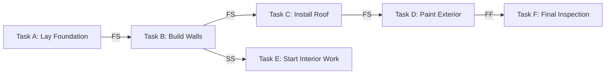

A **Dependency** is a **logical relationship between two or more activities**, where the **timing, sequencing, or completion of one activity depends on another**. Dependencies define the **order of execution** in a project schedule and impact overall project flow.

## **Key Aspects of Dependencies**
- **Control Task Sequencing** – Dictate the order in which tasks must be performed.
- **Impact Schedule Management** – Delays in dependent tasks can affect project deadlines.
- **Can Be Mandatory or Discretionary** – Some dependencies are fixed, while others are based on best practices.
- **Essential for Critical Path Analysis** – Help determine the longest project duration.

## **Types of Dependencies**
| **Type** | **Description** | **Example** |
|----------|------------------------------------------------|----------------------------|
| **Finish-to-Start (FS)** | Task B cannot start until Task A is finished. | A house cannot be painted until construction is completed. |
| **Start-to-Start (SS)** | Task B can start only after Task A has started. | Coding and testing can begin simultaneously after requirements are finalized. |
| **Finish-to-Finish (FF)** | Task B cannot finish until Task A is finished. | Final editing of a book cannot be completed until writing is finished. |
| **Start-to-Finish (SF)** | Task B cannot finish until Task A has started. | A security shift cannot end until the next shift has started. |

## **Mermaid Diagram: Dependency Example**

## **Example Scenarios**

### **Software Development**
A **code review (Task B)** cannot begin until **code implementation (Task A)** is completed (**Finish-to-Start dependency**).

### **Construction Project**
**Plumbing installation (Task B)** must start at the same time as **electrical wiring (Task A)** (**Start-to-Start dependency**).

### **Event Planning**
A **marketing campaign launch (Task B)** cannot be completed until **advertising content creation (Task A)** is finalized (**Finish-to-Finish dependency**).

## **Why Dependencies Matter**
- **Ensure Logical Task Sequencing** – Define relationships between project activities.
- **Improve Scheduling Accuracy** – Helps in setting realistic deadlines.
- **Identify Bottlenecks Early** – Allows proactive risk mitigation.
- **Support Critical Path Analysis** – Helps determine key project constraints.

See also: [[Critical Path Method (CPM)]], [[Task Sequencing]], [[Project Schedule]], [[Lead and Lag Time]].
