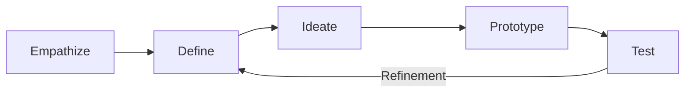

**Design Thinking** is a **nonlinear, iterative process** that teams use to **understand users, challenge assumptions, redefine problems, and develop innovative solutions** through prototyping and testing. It emphasizes **creativity, collaboration, and experimentation** to address complex challenges.

## **Key Aspects of Design Thinking**
- **User-Centered** – Focuses on understanding end-user needs and behaviors.
- **Iterative & Flexible** – Encourages continuous refinement of ideas.
- **Problem-Reframing** – Helps teams explore challenges from different perspectives.
- **Prototyping & Testing** – Rapidly develops and validates solutions.

## **The Five Stages of Design Thinking**
| **Stage**        | **Description** |
|-----------------|------------------------------------------------|
| **Empathize**   | Understand users' needs through research and observation. |
| **Define**      | Clearly articulate the problem based on insights. |
| **Ideate**      | Brainstorm multiple creative solutions. |
| **Prototype**   | Develop low-fidelity representations of ideas for testing. |
| **Test**        | Validate prototypes with users and refine based on feedback. |

## **Mermaid Diagram: Design Thinking Process**

## **Example Scenarios**

### **Product Development**
A team designing a **new mobile app** follows Design Thinking to **observe user behavior, define pain points, prototype UI concepts, and test usability**.

### **Healthcare Innovation**
A hospital uses Design Thinking to **redesign patient intake procedures**, focusing on **reducing wait times and improving user experience**.

### **Business Strategy**
A retail company applies Design Thinking to **explore new market opportunities**, developing **innovative shopping experiences based on customer insights**.

## **Why Design Thinking Matters**
- **Encourages Creativity & Innovation** – Generates out-of-the-box solutions.
- **Enhances User Experience** – Prioritizes human-centered design.
- **Improves Problem-Solving** – Provides structured yet flexible methods to tackle challenges.
- **Reduces Risk of Failure** – Tests and refines solutions before full implementation.

See also: [[User-Centered Design]], [[Prototyping]], [[Innovation Management]], [[Lean Startup Methodology]].
