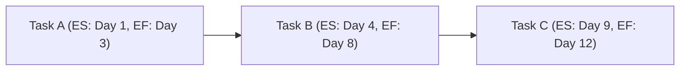

The **Early Finish Date (EF)** is the **earliest possible point in time** when the uncompleted portions of a schedule activity **can finish**, based on the **schedule network logic, the data date, and any schedule constraints**. It is determined using the **Critical Path Method (CPM)** through a **forward pass calculation**.

## **Key Aspects of the Early Finish Date**
- **Represents the Earliest Completion Time** – Accounts for dependencies and constraints.
- **Calculated Using the Forward Pass** – Determines the earliest feasible schedule.
- **Helps Identify Scheduling Flexibility** – Used to assess float (slack) and task dependencies.
- **Directly Affects the Project Completion Date** – Delays in EF impact the overall schedule.

## **Early Finish Calculation**
The formula for determining Early Finish (EF) is:
$$
EF = ES + Duration - 1
$$
Where:
- **EF** = Early Finish Date
- **ES** = Early Start Date
- **Duration** = Activity duration in work periods

## **Example Calculation**
| **Activity** | **Duration (Days)** | **Early Start (ES)** | **Early Finish (EF)** |
|-------------|-----------------|----------------|----------------|
| Task A      | 3               | Day 1          | **Day 3**      |
| Task B      | 5               | Day 4          | **Day 8**      |
| Task C      | 4               | Day 9          | **Day 12**     |

For **Task A**:
$$
EF = 1 + 3 - 1 = 3
$$

For **Task B** (which starts right after Task A finishes):
$$
EF = 4 + 5 - 1 = 8
$$

## **Mermaid Diagram: Early Finish in a Project Schedule**

## **Example Scenarios**

### **Software Development**
A **QA testing phase** must be completed early to **avoid delaying the product release**. The early finish date determines if **buffer time is available**.

### **Construction Project**
A **concrete pouring task** in a building project has an **early finish constraint** due to **curing time requirements before the next phase starts**.

### **Event Planning**
The **early finish date for venue setup** must be achieved to **allow rehearsal time before an event**.

## **Why Early Finish Date Matters**
- **Ensures Schedule Feasibility** – Helps align task completion with overall project goals.
- **Affects Float (Slack) Calculation** – Determines available scheduling flexibility.
- **Supports Critical Path Analysis** – Identifies key constraints affecting completion dates.
- **Prevents Schedule Delays** – Helps teams anticipate and adjust workflows proactively.

See also: [[Early Start Date (ES)]], [[Late Start Date (LS)]], [[Late Finish Date (LF)]], [[Schedule Network Analysis]], [[Critical Path Method (CPM)]].
