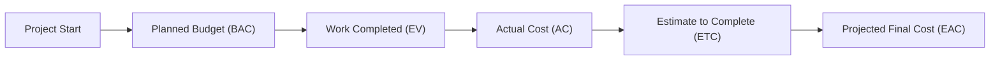

**Estimate at Completion (EAC)** is the **expected total cost to complete all work**, calculated as the **sum of the actual cost incurred to date (AC) and the estimated cost to complete the remaining work (ETC)**. It provides a **realistic projection of the final project cost based on current performance trends**.

## **Key Aspects of Estimate at Completion**
- **Forecasts Final Project Cost** – Helps determine the total expected expenditure.
- **Uses Actual Cost (AC) & Estimate to Complete (ETC)** – Accounts for both past spending and future projections.
- **Adapts to Project Performance** – Adjusts as cost and schedule variances emerge.
- **Supports Budget Control & Risk Management** – Allows proactive financial planning.

## **EAC Calculation Methods**
| **Formula** | **When to Use** | **Calculation** |
|------------|--------------------------------|--------------------------------|
| **EAC = AC + (BAC - EV)** | If past performance is expected to continue. | **AC** = \$150,000, **BAC** = \$500,000, **EV** = \$200,000 → **EAC** = \$450,000 |
| **EAC = BAC / CPI** | If cost performance to date will continue. | **BAC** = \$500,000, **CPI** = 0.9 → **EAC** = \$555,556 |
| **EAC = AC + [(BAC - EV) / (CPI × SPI)]** | If both cost & schedule performance affect completion. | Adjusts for both cost & schedule efficiency. |
| **EAC = AC + ETC** | If past cost variances are no longer relevant. | New ETC is manually determined. |

## **Example Scenarios**

### **Software Development**
A **mobile app project** had an original budget (**BAC**) of **\$1,000,000**. The team has **spent \$400,000 so far (AC)** and completed **50% of planned work (EV = \$500,000)**. Using **EAC = BAC / CPI**:
- **CPI = EV / AC = 500,000 / 400,000 = 1.25**
- **EAC = 1,000,000 / 1.25 = \$800,000**
- **Result: The project is performing well and will likely finish under budget.**

### **Construction Project**
A **building renovation** was estimated to cost **\$2 million** (**BAC**).  
Due to **material shortages**, the project is overspending, and the **cost trend suggests additional expenses**.  
Using **EAC = AC + (BAC - EV)**:
- **AC = \$1.2M**, **BAC = \$2M**, **EV = \$900K**
- **EAC = 1.2M + (2M - 900K) = 2.3M**
- **Result: The project will likely exceed budget by \$300,000.**

### **Marketing Campaign**
A company planned a **marketing campaign with a budget of \$200,000** but faced **unexpected advertising costs**.  
Using **EAC = AC + ETC**, a revised estimate is made based on the updated financial outlook.

## **Mermaid Diagram: EAC Process**

## **Why Estimate at Completion Matters**
- **Improves Cost Forecasting** – Provides accurate projections of total project costs.
- **Identifies Budget Overruns Early** – Helps detect financial risks before they escalate.
- **Supports Informed Decision-Making** – Enables proactive adjustments to spending.
- **Enhances Stakeholder Communication** – Ensures transparency in budget expectations.

See also: [[[[actual_cost|Actual Cost (AC)]], [[Budget at Completion (BAC)]], [[Earned Value (EV)]], [[Estimate to Complete (ETC)]], [[Planned Value (PV)]].
