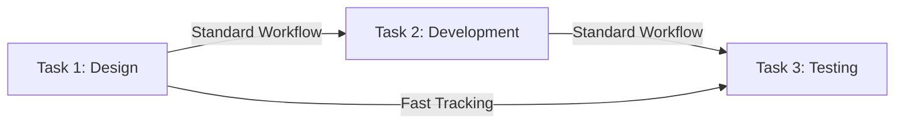

**Fast Tracking** is a **schedule compression technique** in which **activities or phases that are normally done in sequence are performed in parallel** for at least a portion of their duration. This method accelerates project timelines but **increases risk and complexity**.

## **Key Aspects of Fast Tracking**
- **Reduces Project Duration** – Helps meet tight deadlines by overlapping tasks.
- **Applies to Dependent Activities** – Works best when tasks have finish-to-start dependencies.
- **Increases Risk & Rework Potential** – May require additional coordination to prevent errors.
- **Common in High-Priority Projects** – Often used when schedule constraints are critical.

## **Fast Tracking vs. Crashing**
| **Technique**  | **Description** | **Impact on Cost** | **Impact on Risk** |
|---------------|------------------------------------------------|----------------|----------------|
| **Fast Tracking** | Performing activities in parallel instead of sequentially. | No additional cost but may require extra effort. | Higher risk due to increased dependencies. |
| **Crashing** | Adding extra resources to speed up completion. | Increases cost due to overtime or additional labor. | Moderate risk, mainly from cost overruns. |

## **Example Scenarios**

### **Software Development**
A project **fast-tracks development and testing**, allowing **QA teams to begin validating features before full implementation is complete**.

### **Construction Project**
A **building project** accelerates completion by **starting interior work before exterior construction is fully finished**, reducing total duration.

### **Product Launch**
A marketing team **starts promotional campaigns while product development is still ongoing**, ensuring launch readiness.

## **Mermaid Diagram: Fast Tracking Workflow**

## Why Fast Tracking Matters

- Speeds Up Project Completion – Useful in deadline-driven projects.
- Avoids Additional Costs – Unlike crashing, no extra labor is needed.
- Requires Careful Risk Management – Overlapping tasks increase error potential.
- Improves Time-to-Market – Helps deliver products and services faster.

See also: [[Crashing]], [[Schedule Compression]], [[Critical Path Method (CPM)]], [[Project Schedule Optimization]].