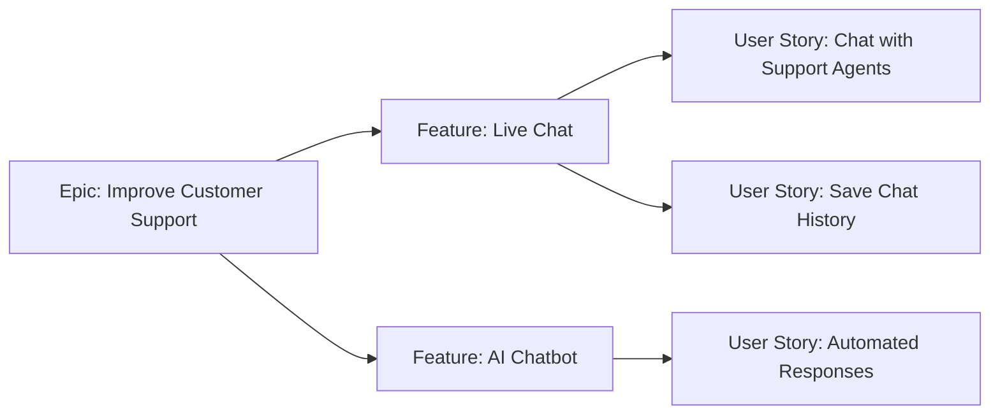

A **Feature** is a **set of related requirements or functionalities** that provide **value to an organization**. Features are typically **larger than user stories but smaller than epics**, forming a critical part of product development and project execution.

## **Key Aspects of a Feature**
- **Delivers Business or User Value** – Each feature contributes to strategic goals.
- **Consists of Multiple User Stories** – Breaks down into smaller, actionable work units.
- **Can Be Independent or Dependent** – Some features stand alone, while others require dependencies.
- **Common in Agile and Traditional Project Management** – Used in frameworks like Scrum, SAFe®, and Waterfall.

## **Feature vs. Epic vs. User Story**
| **Work Item** | **Description** | **Example** |
|--------------|------------------------------------------------|--------------------------------|
| **Epic** | A large initiative that aligns with business goals. | "Enhance Customer Self-Service" |
| **Feature** | A functional component of an epic. | "Add Live Chat to Customer Support" |
| **User Story** | A detailed requirement that defines user interactions. | "As a user, I want to chat with support for real-time help." |

## **Example Scenarios**

### **Software Development**
A SaaS company introduces a **feature for two-factor authentication (2FA)** to improve **user security and compliance**.

### **E-Commerce Platform**
A retailer adds a **feature for personalized product recommendations**, increasing **customer engagement and conversions**.

### **Construction Project**
A **smart home system** integrates a **feature for voice-controlled lighting**, enhancing **home automation capabilities**.

## **Mermaid Diagram: Feature Breakdown**

## Why Features Matter

- Improve Product Functionality – Define how a system evolves.
- Support Agile and Incremental Delivery – Help teams release value iteratively.
- Enhance Stakeholder Alignment – Ensure development meets business priorities.
- Provide Clear Scope for Teams – Organize work into structured deliverables.

See also: [[User Story]], [[Epic]], [[Product Backlog]], [[Sprint Planning]], [[Agile Roadmap]].