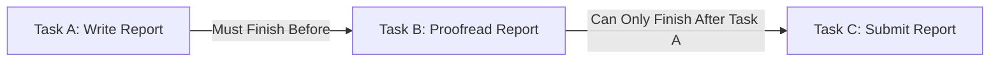

**Finish-to-Finish (FF)** is a **logical relationship** in which a **successor activity cannot finish until its predecessor activity has finished**. This dependency ensures that two tasks are completed in alignment, even if they do not start at the same time.

## **Key Aspects of Finish-to-Finish**
- **Predecessor Must Finish Before Successor Can Finish** – The second task cannot complete until the first one is done.
- **Both Activities Can Run in Parallel** – They may overlap, but the second task cannot complete before the first.
- **Common in Dependent Workflows** – Frequently used in software development, manufacturing, and event planning.

## **Finish-to-Finish vs. Other Logical Relationships**
| **Dependency Type** | **Definition** | **Example** |
|--------------------|------------------------------------------------|--------------------------------|
| **Finish-to-Finish (FF)** | Successor cannot finish until predecessor finishes. | Editing a document cannot finish until writing is complete. |
| **Finish-to-Start (FS)** | Successor cannot start until predecessor finishes. | Testing starts only after coding is complete. |
| **Start-to-Start (SS)** | Successor cannot start until predecessor starts. | Pouring concrete starts only after mixing begins. |
| **Start-to-Finish (SF)** | Successor cannot finish until predecessor starts. | A night shift worker cannot end their shift until the next worker starts. |

## **Example Scenarios**

### **Software Development**
A **feature release cannot finish** until **all bug testing is completed**, ensuring a quality deployment.

### **Construction Project**
A **building’s interior painting cannot finish** until the **final wall plastering is completed**.

### **Marketing Campaign**
A **video ad campaign’s editing phase** cannot finish until **all raw footage has been recorded**.

## **Mermaid Diagram: Finish-to-Finish Dependency**

## Why Finish-to-Finish Matters

- Ensures Task Completion Alignment – Prevents premature closure of dependent tasks.
- Improves Scheduling Accuracy – Helps teams manage interdependent workflows.
- Reduces Risk of Incomplete Deliverables – Ensures quality control before moving forward.
- Supports Critical Path Analysis – Helps in identifying scheduling constraints.

See also: [[Finish-to-Start (FS)]], [[Start-to-Finish (SF)]], [[Start-to-Start (SS)]], [[Logical Relationship]], [[Schedule Network Diagram]].