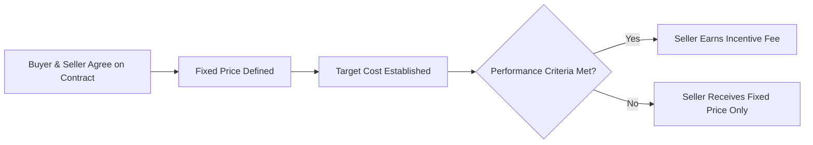

A **Fixed-Price Incentive-Fee (FPIF) Contract** is a **contract type where the buyer pays the seller a fixed amount**, as defined in the contract, and the seller **can earn an additional incentive fee if they meet specific performance criteria**. This contract structure encourages **efficiency, cost control, and quality delivery**.

## **Key Aspects of FPIF Contracts**
- **Base Price Is Fixed** – The contract establishes a minimum guaranteed payment.
- **Performance-Based Incentives** – The seller can receive additional compensation for meeting or exceeding predefined goals.
- **Encourages Cost & Schedule Efficiency** – Sellers are motivated to control expenses and deliver early.
- **Used for Performance-Sensitive Projects** – Common in construction, IT, and government contracts.

## **FPIF Contract Structure**
| **Component** | **Description** |
|--------------|------------------------------------------------|
| **Fixed Price** | The base amount the buyer agrees to pay the seller. |
| **Target Cost** | The estimated cost of the work that both parties agree upon. |
| **Incentive Fee** | A bonus awarded if the seller meets performance goals (e.g., cost savings, early delivery, quality standards). |
| **Share Ratio** | Defines how cost savings or overruns are shared between the buyer and seller. |

## **Example Scenarios**

### **Software Development**
A company **contracts a vendor** for a **\$200,000 software project**, with an **incentive of \$20,000** for early delivery.

### **Construction Project**
A **government agency awards a bridge construction contract** with a **base price of \$5 million** and a **performance bonus of \$500,000** if the project is completed **ahead of schedule**.

### **Manufacturing**
A **military supplier** is given an **FPIF contract for jet engines**, where **cost savings beyond the target budget** are **shared 60/40** between the buyer and seller.

## **Mermaid Diagram: FPIF Contract Flow**

## Why Fixed-Price Incentive-Fee Contracts Matter

- Encourages Cost Control – Sellers are motivated to stay within budget.
- Drives High-Quality Performance – Incentivizes meeting or exceeding expectations.
- Balances Risk & Reward – Reduces buyer risk while rewarding efficiency.
- Supports Large-Scale Projects – Common in government and high-value contracts.

See also: [[Firm-Fixed-Price (FFP) Contract]], [[Cost-Plus-Incentive-Fee (CPIF) Contract]], [[Time & Materials (T&M) Contract]], [[Procurement Management]].