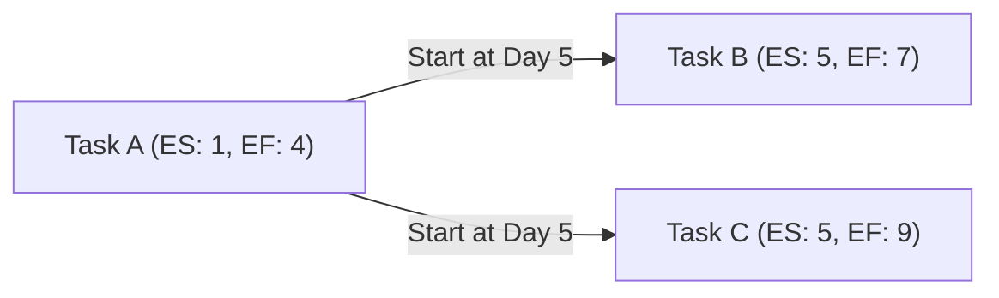

**Forward Pass** is a **Critical Path Method (CPM) technique** used to **calculate the earliest possible start (ES) and early finish (EF) dates for activities** by **working forward through the schedule model** from the project start date or a given point in time.

## **Key Aspects of Forward Pass**
- **Determines Earliest Start & Finish Dates** – Identifies the soonest an activity can begin and end.
- **Establishes the Project Duration** – Helps define the minimum completion time.
- **Identifies Critical Path Activities** – Highlights tasks that drive project timelines.
- **Works in Sequence from Start to Finish** – Moves through the schedule from the first task to the last.

## **Forward Pass Formula**
| **Formula** | **Definition** |
|------------|------------------------------------------------|
| **ES = EF of predecessor + 1** | Early Start (ES) is the next available time unit after the predecessor's Early Finish (EF). |
| **EF = ES + Duration - 1** | Early Finish (EF) is calculated by adding the activity duration to ES. |

## **Example Calculation**
Assume the following activities:
- **Task A** (Duration: 4 days)
- **Task B** (Duration: 3 days, depends on Task A)
- **Task C** (Duration: 5 days, depends on Task A)

| **Task** | **Duration** | **Early Start (ES)** | **Early Finish (EF)** |
|---------|------------|-----------------|-----------------|
| **A**  | 4 days    | 1               | 4               |
| **B**  | 3 days    | 5               | 7               |
| **C**  | 5 days    | 5               | 9               |

## **Mermaid Diagram: Forward Pass Calculation**

## Why Forward Pass Matters

- Defines the Earliest Possible Completion Date – Essential for project planning.
- Identifies Critical Path Tasks – Determines which activities cannot be delayed.
- Supports Scheduling & Resource Allocation – Ensures tasks are planned efficiently.
- Improves Time Management – Helps teams meet deadlines with better visibility.

See also: [[Backward Pass]], [[Critical Path Method (CPM)]], [[Schedule Network Diagram]], [[Total Float]].