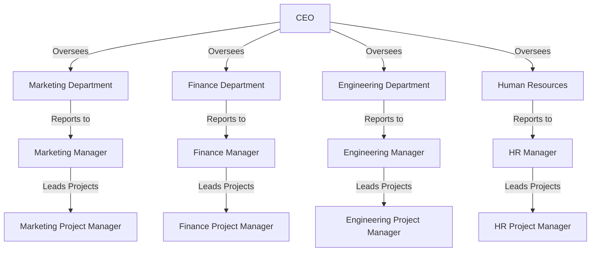

A **Functional Organization** is an **organizational structure** in which **staff is grouped by areas of specialization**, such as marketing, finance, or engineering. In this structure, **the project manager has limited authority** and must **work through functional managers to assign work and apply resources**.

## **Key Aspects of a Functional Organization**
- **Department-Based Structure** – Employees report to functional managers within their expertise.
- **Limited Project Manager Authority** – The project manager has little control over resources.
- **Stronger Functional Hierarchy** – Functional managers have full decision-making power.
- **Best for Operational Efficiency** – Works well for organizations with ongoing, stable operations.

## **Example of Functional Departments**
| **Department** | **Responsibilities** |
|--------------|------------------------------------------------|
| **Marketing** | Branding, advertising, customer outreach. |
| **Finance** | Budgeting, financial planning, audits. |
| **Engineering** | Product development, R&D, technical execution. |
| **Human Resources** | Hiring, employee relations, training programs. |

## **Mermaid Diagram: Functional Organization Structure**

Why Functional Organizations Matter

- Provides Clear Role Specialization – Employees stay focused within their expertise.
- Ensures Strong Departmental Control – Functional managers have direct authority.
- Reduces Project Manager Autonomy – Projects must align with departmental priorities.
- Best for Stable, Process-Driven Environments – Effective when operations require specialized knowledge.

See also: [[Matrix Organization]], [[Projectized Organization]], [[Resource Management]], [[Organizational Structures]].