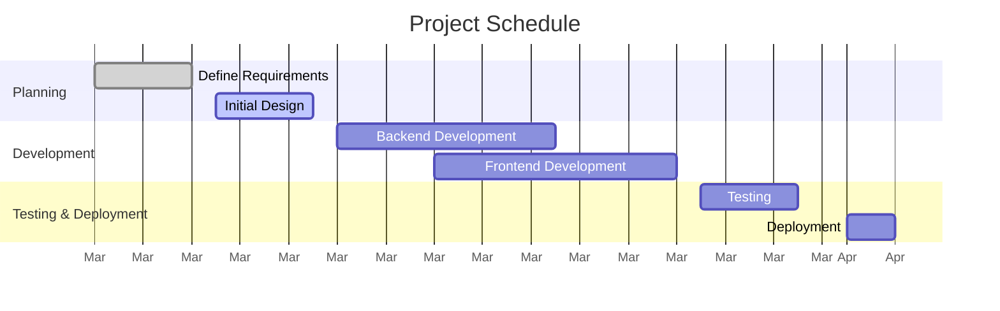

A **Gantt Chart** is a **bar chart used for project scheduling**, where:
- **Activities are listed on the vertical axis.**
- **Dates are displayed on the horizontal axis.**
- **Activity durations are represented by horizontal bars** according to their start and finish dates.

## **Key Aspects of Gantt Charts**
- **Visualizes Task Scheduling** – Shows when tasks start and end.
- **Helps Track Project Progress** – Allows easy identification of delays or overlaps.
- **Identifies Dependencies** – Shows how tasks are connected.
- **Works Well with Critical Path Analysis** – Helps in project planning and execution.

## **Example Gantt Chart**

## **Project Schedule Breakdown**

| **Task Name**            | **Section**               | **Start Date** | **End Date** |
|-------------------------|--------------------------|--------------|------------|
| Define Requirements     | Planning                 | Mar 01, 2024 | Mar 05, 2024 |
| Initial Design          | Planning                 | Mar 06, 2024 | Mar 10, 2024 |
| Backend Development     | Development              | Mar 11, 2024 | Mar 20, 2024 |
| Frontend Development    | Development              | Mar 15, 2024 | Mar 25, 2024 |
| Testing                | Testing & Deployment     | Mar 26, 2024 | Mar 30, 2024 |
| Deployment             | Testing & Deployment     | Apr 01, 2024 | Apr 03, 2024 |

## Why Gantt Charts Matter

- Improves Time Management – Helps teams stay on track.
- Enhances Resource Allocation – Prevents overloading team members.
- Supports Dependency Tracking – Ensures tasks are completed in the right order.
- Provides a High-Level Overview – Simplifies communication with stakeholders.

See also: [[Critical Path Method (CPM)]], [[Schedule Network Diagram]], [[Task Dependencies]], [[Project Scheduling]].