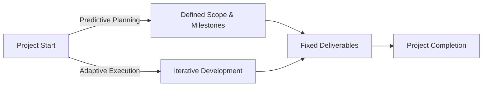

## **Hybrid Approach**
A **Hybrid Approach** combines elements from **both adaptive (Agile) and predictive (Waterfall) approaches**, making it useful when **there is uncertainty or risk around the requirements**. This method allows teams to leverage the **structured planning of predictive methods** while maintaining **flexibility from adaptive approaches**.

### **Key Aspects of a Hybrid Approach**
- **Uses Predictive Planning for Known Elements** – Fixed scope, deadlines, and regulatory requirements follow traditional planning.
- **Uses Adaptive Methods for Uncertain Aspects** – Iterative development is used for evolving features or high-risk areas.
- **Balances Structure & Flexibility** – Provides control while accommodating change.
- **Works Well for Complex Projects** – Ideal when different project components require different methodologies.

### **Example Scenarios**

#### **Software Development**
- **Core infrastructure (databases, security, architecture) follows Waterfall.**
- **User-facing features (UI/UX, functionality) follow Agile sprints.**

#### **Construction Project**
- **Building design and permitting use a predictive approach.**
- **Interior customization and finishing adapt to client preferences using Agile principles.**

#### **Marketing Campaign**
- **Regulatory approvals and budget allocation follow a predictive method.**
- **Content creation and social media strategies iterate based on engagement data.**

### **Mermaid Diagram: Hybrid Approach Workflow**

## Why Hybrid Approach Matters

- Balances Control & Adaptability – Combines structured planning with Agile flexibility.
- Reduces Risk in Uncertain Projects – Allows adjustments for unknown factors.
- Optimizes Resource Allocation – Matches the right approach to different project components.
- Supports Stakeholder Needs – Addresses regulatory and business requirements while remaining responsive.

See also: [[Adaptive Approach]], [[Predictive Approach]], [[Agile Methodology]], [[Waterfall Model]], [[Risk Management]].