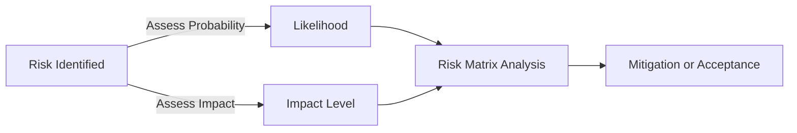

## **Impact**
**Impact** is a **measure of the effect of a risk** on one or more project objectives **if it occurs**. It helps teams assess **how significantly a risk event could influence cost, schedule, scope, quality, or stakeholder expectations**.

### **Key Aspects of Impact**
- **Used in Risk Assessment** – Helps determine how severe a risk event would be.
- **Measured Qualitatively or Quantitatively** – Can be expressed in terms of cost, time, or stakeholder impact.
- **Essential for Decision-Making** – Prioritizes which risks require mitigation.
- **Works with Probability for Risk Analysis** – A key factor in risk response planning.

### **Impact Levels in Risk Analysis**
| **Impact Level**  | **Description** |
|------------------|------------------------------------------------|
| **Low**         | Minor effect; easily managed without major changes. |
| **Moderate**    | Noticeable impact; requires some adjustments to resources or schedule. |
| **High**        | Significant disruption; project success may be at risk. |
| **Critical**    | Major failure; severe impact on project objectives. |

### **Example Scenarios**

#### **Software Development**
- **Risk:** A key developer resigns mid-project.
- **Impact:** **Moderate to High** – Potential delays while onboarding a replacement.

#### **Construction Project**
- **Risk:** A supplier fails to deliver materials on time.
- **Impact:** **High to Critical** – Delays may halt construction and increase costs.

#### **Marketing Campaign**
- **Risk:** A social media backlash against an ad campaign.
- **Impact:** **Critical** – Brand reputation damage and loss of customer trust.

### **Mermaid Diagram: Impact & Risk Flow**

## Why Impact Matters

- Improves Risk Prioritization – Helps teams focus on the most severe risks.
- Enhances Decision-Making – Supports proactive mitigation strategies.
- Prevents Costly Surprises – Ensures teams prepare for high-impact risks.
- Strengthens Project Resilience – Helps teams adapt effectively when issues arise.

See also: [[Risk Management]], [[Probability and Impact Matrix]], [[Risk Mitigation]], [[Contingency Planning]].