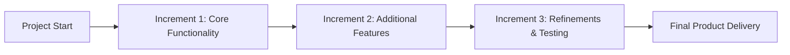

## **Increment**
An **increment** is a **functional, tested, and accepted deliverable** that represents a **subset of the overall project output**. In iterative and incremental development approaches, such as **Agile**, each increment **adds value** and moves the project closer to completion.

### **Key Aspects of an Increment**
- **Delivers Usable Value** – Each increment contributes to the final product.
- **Tested & Accepted** – Ensures quality before progressing further.
- **Supports Iterative Development** – Common in Agile methodologies like Scrum.
- **Builds Towards Project Completion** – Each release refines and improves the product.

### **Example Scenarios**

#### **Software Development**
- **Increment:** A new **user authentication system** is deployed.
- **Impact:** Users can now **securely log in**, even though other features are still in development.

#### **Construction Project**
- **Increment:** The **foundation of a building is completed**.
- **Impact:** The structure is ready for **next-phase construction work**.

#### **Marketing Campaign**
- **Increment:** The **first wave of social media ads is launched**.
- **Impact:** Data from early campaigns informs **future ad adjustments**.

### **Mermaid Diagram: Incremental Development Flow**

## Why Increments Matter

- Delivers Value Early & Often – Enables continuous stakeholder feedback.
- Reduces Risk – Issues can be identified and fixed before final delivery.
- Improves Adaptability – Teams can adjust plans based on real-world use.
- Enhances Customer Satisfaction – Frequent releases ensure evolving needs are met.

See also: [[Iteration]], [[Agile Development]], [[Minimum Viable Product (MVP)]], [[Sprint Review]].

