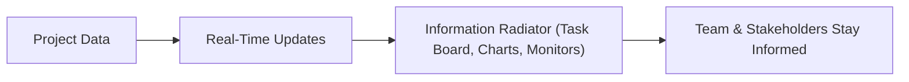

## **Information Radiator**
An **Information Radiator** is a **visible, physical display** that provides **real-time information** to the organization, enabling **timely knowledge sharing**. It is designed to **increase transparency**, **improve collaboration**, and **ensure that key project details are accessible at a glance**.

### **Key Aspects of an Information Radiator**
- **Highly Visible & Accessible** – Placed in common areas for quick reference.
- **Provides Real-Time Updates** – Continuously reflects current project status.
- **Encourages Transparency** – Helps teams and stakeholders stay informed.
- **Reduces Communication Bottlenecks** – Eliminates unnecessary status meetings.

### **Common Types of Information Radiators**
| **Type**                | **Purpose** |
|------------------------|------------------------------------------------|
| **Task Board**         | Tracks work progress in Agile teams (To-Do, In Progress, Done). |
| **Burndown Chart**     | Displays remaining work over time to track progress. |
| **Kanban Board**       | Visualizes workflow and limits work in progress. |
| **Risk Board**         | Highlights project risks and mitigation strategies. |
| **Build Monitor**      | Shows real-time status of software builds and deployments. |

### **Example Scenarios**

#### **Software Development**
- A **Kanban board** in the team room displays the **status of development tasks**.
- A **build status monitor** updates in real time when deployments succeed or fail.

#### **Construction Project**
- A **progress tracking board** shows which **phases of the build are completed**.
- A **safety dashboard** lists recent **incidents, compliance updates, and safety tips**.

#### **Marketing Campaign**
- A **social media analytics display** presents **engagement stats and campaign reach**.
- A **content calendar** outlines upcoming **blog posts and advertising schedules**.

### **Mermaid Diagram: Information Radiator Workflow**

## Why Information Radiators Matter

- Enhance Team Visibility – Everyone has access to the same information.
- Promote Accountability – Encourages ownership of tasks and progress.
- Reduce Unnecessary Meetings – Eliminates constant status update discussions.
- Support Agile & Lean Workflows – Encourages continuous improvement.

See also: [[Kanban Board]], [[Burndown Chart]], [[Task Board]], [[Agile Metrics]], [[Team Communication]].