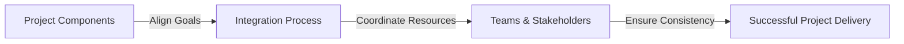

## **Integration**
**Integration** is the **coordination of all project elements** to ensure they work together effectively, allowing the project to meet its objectives within defined goals. It involves **aligning processes, teams, deliverables, and resources** for seamless execution.

### **Key Aspects of Integration**
- **Ensures Consistency Across Project Components** – Aligns scope, schedule, cost, and resources.
- **Facilitates Communication Between Teams** – Ensures all stakeholders are informed.
- **Manages Dependencies & Transitions** – Handles interrelated project components efficiently.
- **Supports Strategic Alignment** – Ensures the project contributes to organizational goals.

### **Core Areas of Project Integration**
| **Integration Area**          | **Purpose** |
|-----------------------------|------------------------------------------------|
| **Scope Integration**       | Ensures deliverables align with project objectives. |
| **Schedule Integration**    | Synchronizes timelines and milestones across teams. |
| **Cost Integration**        | Aligns financial planning with project progress. |
| **Risk Integration**        | Identifies and mitigates cross-functional risks. |
| **Stakeholder Integration** | Balances expectations and communication between all involved parties. |

### **Example Scenarios**

#### **Software Development**
- **Integration Task:** Aligning **frontend and backend teams** to ensure seamless data flow.
- **Impact:** Reduces bugs and enhances product functionality.

#### **Construction Project**
- **Integration Task:** Coordinating **architects, engineers, and contractors** to avoid conflicts in building plans.
- **Impact:** Prevents costly rework and delays.

#### **Marketing Campaign**
- **Integration Task:** Aligning **content creation, social media, and advertising teams** to deliver a unified campaign.
- **Impact:** Ensures consistent messaging across all channels.

### **Mermaid Diagram: Integration Workflow**

## Why Integration Matters

- Ensures Smooth Execution – Reduces conflicts between different project elements.
- Minimizes Risk – Proactively addresses interdependencies.
- Enhances Efficiency – Improves collaboration and reduces redundancy.
- Supports Organizational Goals – Aligns project outputs with business strategy.

See also: [[Project Integration Management]], [[Stakeholder Engagement]], [[Change Control Process]], [[Risk Management]].