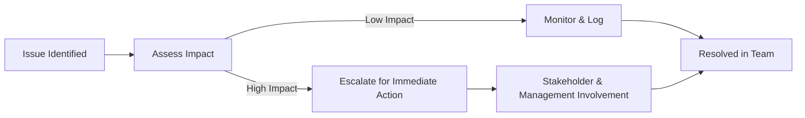

## **Issue**
An **issue** is a **current condition or situation that may impact one or more project objectives**. Unlike risks, which are **potential future events**, issues are **problems that have already occurred** and require resolution.

### **Key Aspects of an Issue**
- **Already Happening** – Unlike risks, issues are not hypothetical.
- **Requires Immediate Attention** – Needs mitigation or resolution.
- **May Affect Scope, Budget, or Schedule** – Can cause delays or cost overruns.
- **Tracked in an Issue Log** – Helps teams document and manage resolution efforts.

### **Common Types of Issues**
| **Issue Type**        | **Description** |
|----------------------|------------------------------------------------|
| **Technical Issues**  | Software bugs, infrastructure failures, system downtime. |
| **Resource Issues**   | Lack of staffing, skill shortages, equipment unavailability. |
| **Stakeholder Issues** | Conflicting priorities, misaligned expectations, lack of engagement. |
| **Scope Issues**      | Unapproved scope changes, unclear requirements, miscommunication. |

### **Example Scenarios**

#### **Software Development**
- **Issue:** A **critical security vulnerability** is discovered in production.
- **Impact:** Must be **fixed immediately** to prevent data breaches.

#### **Construction Project**
- **Issue:** A **supplier fails to deliver materials on time**.
- **Impact:** Causes **delays in structural work** and affects the project timeline.

#### **Marketing Campaign**
- **Issue:** A **key partnership falls through** before a product launch.
- **Impact:** The team must **find alternative promotional strategies** quickly.

### **Mermaid Diagram: Issue Resolution Process**

## Why Issue Management Matters

- Prevents Project Disruptions – Ensures issues don’t escalate into larger problems.
- Improves Decision-Making – Helps teams act quickly with documented resolution steps.
- Enhances Communication – Keeps stakeholders informed about ongoing challenges.
- Supports Project Success – Ensures timely issue resolution to maintain progress.

See also: [[Risk Management]], [[Issue Log]], [[Change Control Process]], [[Stakeholder Communication]].