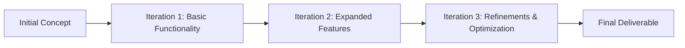

An **Iterative Approach** is a **development method that starts with an initial, simplified implementation and progressively elaborates, adding functionality until the final deliverable is complete**. Each iteration **refines and enhances the product based on feedback and testing**, ensuring continuous improvement.

### **Key Aspects of an Iterative Approach**
- **Begins with a Basic Implementation** – Starts with a working but minimal version.
- **Builds on Previous Versions** – Each cycle adds improvements and new features.
- **Encourages Continuous Feedback** – Stakeholders review and refine after each iteration.
- **Balances Flexibility & Structure** – Allows adjustments while maintaining a development roadmap.

### **Example Scenarios**

#### **Software Development**
- **Iteration 1:** Basic login system implemented.
- **Iteration 2:** Profile settings and user dashboard added.
- **Iteration 3:** Advanced security and analytics integrated.

#### **Product Design**
- **Iteration 1:** Wireframe prototype created.
- **Iteration 2:** High-fidelity design based on user testing.
- **Iteration 3:** Final UI implemented with interactive elements.

#### **Marketing Campaign**
- **Iteration 1:** Initial ad creative tested.
- **Iteration 2:** Audience targeting refined based on engagement.
- **Iteration 3:** Full-scale campaign launched with optimized messaging.

### **Mermaid Diagram: Iterative Approach Workflow**

##  Why an Iterative Approach Matters

- Improves Quality Over Time – Refinements based on real-world use.
- Enhances Stakeholder Involvement – Encourages ongoing feedback.
- Reduces Project Risk – Issues can be addressed early rather than at the final stage.
- Supports Agile & Incremental Development – Enables flexibility in evolving projects.

See also: [[Incremental Approach]], [[Iteration]], [[Agile Development]], [[Prototyping]].